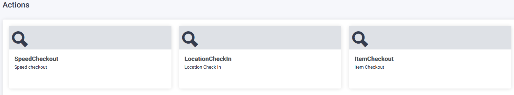
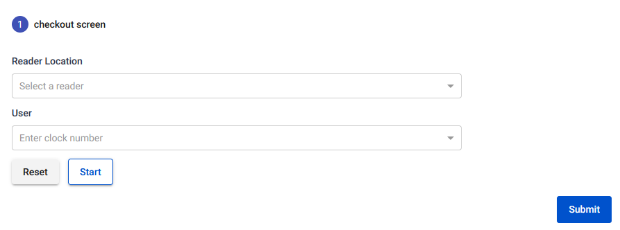
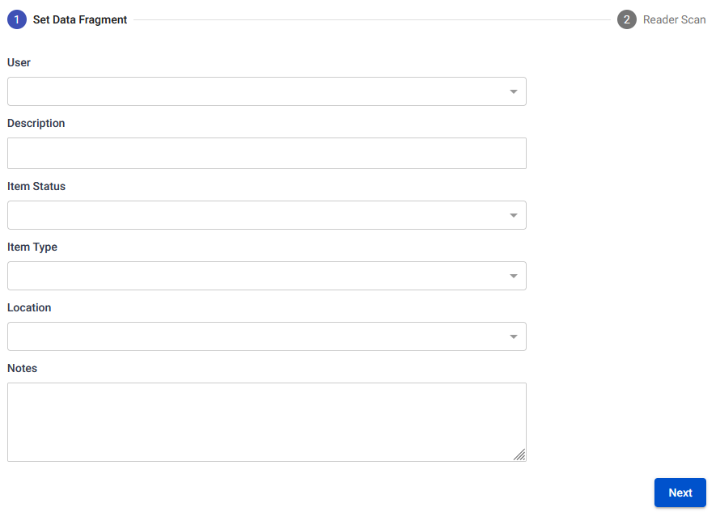
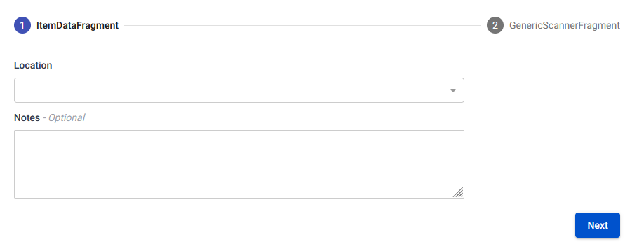

The Actions Page provides support for ad hoc tasks, allowing users to quickly and easily perform tasks as needed without requiring a predefined plan or process.

## Action Form

To view predefined tasks to be performed, follow these steps on the Actions Page:

1. Click on the clickable card associated with the desired task.
2. You will be redirected to the Action Form page, where you can view the details of the predefined task and perform the necessary actions.

## Speed check-out

To perform an ad hoc Speed checkout task, follow these steps on the Actions Page:

1. Click on the Speed checkout action item.
2. You will be redirected to the Action Form page.
3. On the Action Form page, you will find a stepper that includes a reader location dropdown, a reset and start button, and a next button.
4. Follow the steps provided in the stepper to complete the Speed checkout task.

## Location check-in

To perform an ad hoc Location check-in task, follow these steps on the Actions Page:

1. Click on the Location check-in action item.
2. You will be redirected to the Action Form page.
3. On the Action Form page, you will find a stepper that includes a reader location dropdown, a reset and start button, and a next button.
4. Follow the steps provided in the stepper to complete the Location check-in task.

## Item check-in

To perform an ad hoc Item check-in task, follow these steps on the Actions Page:

1. Click on the Item check-in action item.
2. You will be redirected to the Action Form page.
3. On the Action Form page, you will find a stepper that includes a reader location dropdown, a reset and start button, and a next button.
4. Follow the steps provided in the stepper to complete the Item check-in task.
