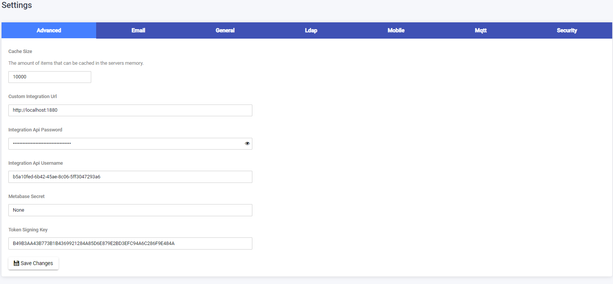
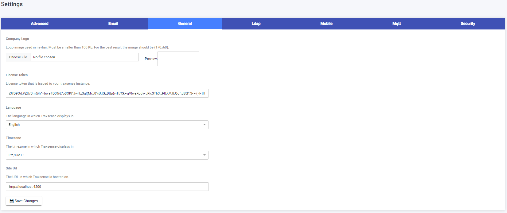
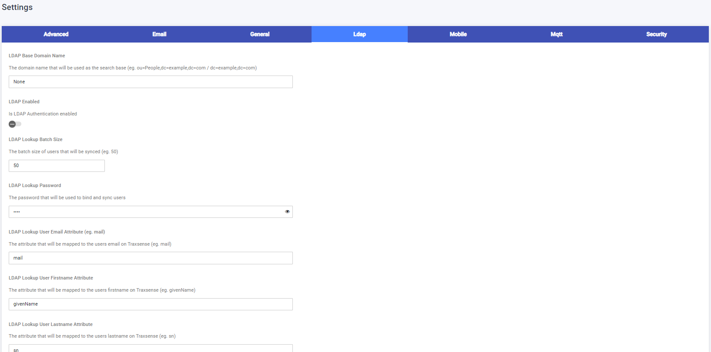
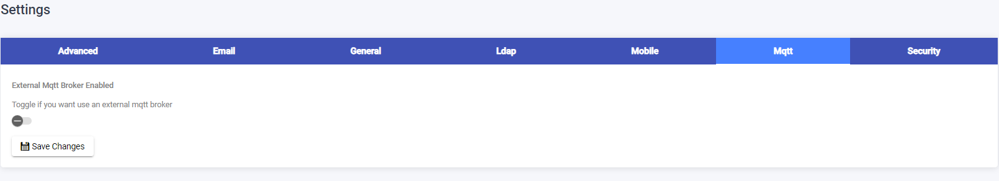
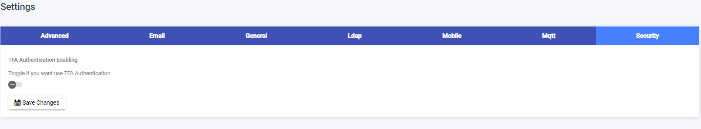

## Settings Page

The Settings Page provides various configuration options for the system.

### Advanced Settings

Advanced settings are configured by developers or administrators with knowledge of the system. These settings may include integration configurations and other advanced options specific to the system implementation.

### Email Settings

To configure the system to send emails, follow these steps:

1. On the Settings Page, locate the "Email Settings" section.
2. Add the required information.
3. Click the "Save" button to save the email settings.
   

### General Settings

To edit general system settings, follow these steps:

1. On the Settings Page, locate the "General Settings" section.
2. Edit the desired settings.
3. Click the "Save" button to save the general settings.
   

### LDAP

LDAP support allows the application to connect to a directory server to retrieve important information such as user login credentials or organizational structures. LDAP settings are configured by developers or administrators with knowledge of LDAP integration.

### Mobile Settings

To edit mobile reader settings, follow these steps:

1. On the Settings Page, locate the "Mobile Settings" section.
2. Edit the desired settings.
3. Click the "Save" button to save the mobile reader settings.
   

### Mqtt Settings

To edit mqtt settings, follow these steps:

1. On the Settings Page, locate the "Mqtt Settings" section.
2. Edit the desired settings.
3. Click the "Save" button to save the mqtt settings.
   

### Security Settings

To edit security settings, follow these steps:

1. On the Settings Page, locate the "Security Settings" section.
2. Edit the desired settings.
3. Click the "Save" button to save the security settings.
   
