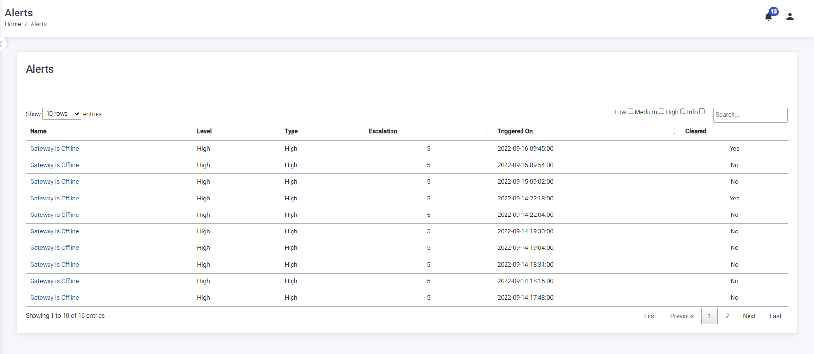
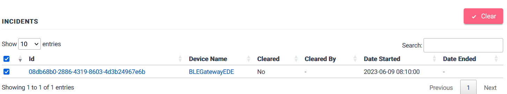
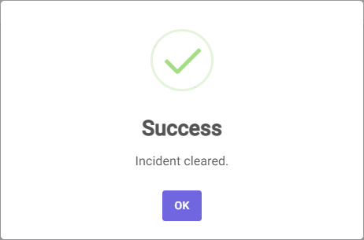
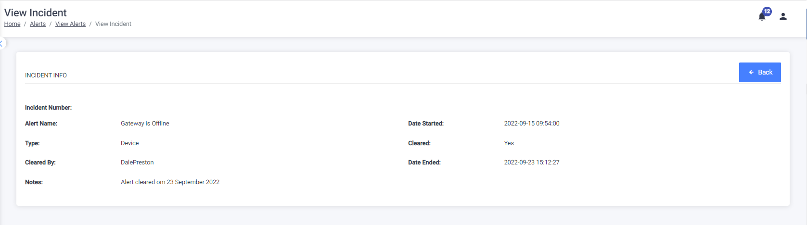

You can view alerts for disrupted events, such as failed inspections and offline devices, by clicking on the name of the alert. This feature allows you to stay informed about potential issues and access detailed information regarding each alert.

The alerts can be viewed according to severity by selecting the checkbox on the right-hand side of the screen as indicated below:

## View Alerts

To view each alert, follow these steps on the Alerts Page:

1. Click on the clickable name of the alert.
2. You will be directed to the View Alerts page, which provides a summary of the alert.
3. The page also displays incidents related to the specific alert that need to be cleared.

To view the alert details, click on the Alert Name.

To return to the Alerts Management page click on the Back button.

### Manage Alerts

To clear or acknowledge an Alert, click on the check box on the left of the screen and the Clear button will become visible

Clicking on the Clear button and the following message will be displayed:

A note can be added, once the note is added click on the Save Note button , if the user does not want to add a note click on the Skip button.

Click on the Ok button to return to the Alert Info screen.

The note can be viewed on the view incident screen.

To return to the Alerts page, click on the Back button
