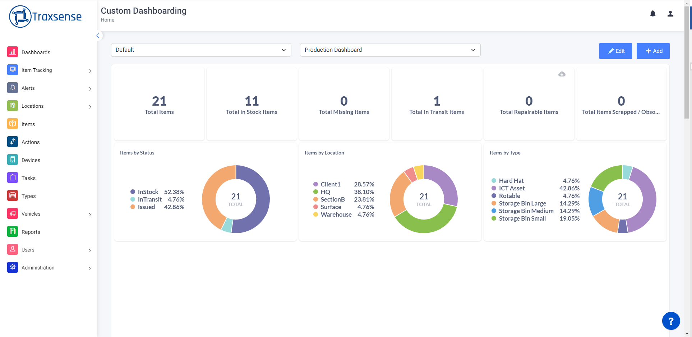

The Dashboard Page is a central hub where users can access and interact with visualized data in the form of graphs and other visual elements.

## Auto redirection

Upon logging in, users are automatically redirected to the Dashboard Page, where they can immediately start visualizing data.

### Add button

Users with assigned permissions can create a new dashboard by clicking the Add button. The creation process involves specifying multiple organizations, selecting user roles, and indicating the type of the dashboard (Dashboard or Report).

### Edit button

Users with editing permissions can modify existing dashboard data by clicking the Edit button. They can add or remove organizations, manage user roles, and change the type of the dashboard (Dashboard or Report).

### Refresh button

The Refresh button allows users with create permissions to reload the Dashboard Page from scratch. This action is useful when the page appears to be stuck or unresponsive.

### Delete button

Users with editing permissions can delete a dashboard by clicking the Delete button. This action redirects them to the Manage Dashboard page, where they can confirm the deletion by interacting with a warning pop-up.
