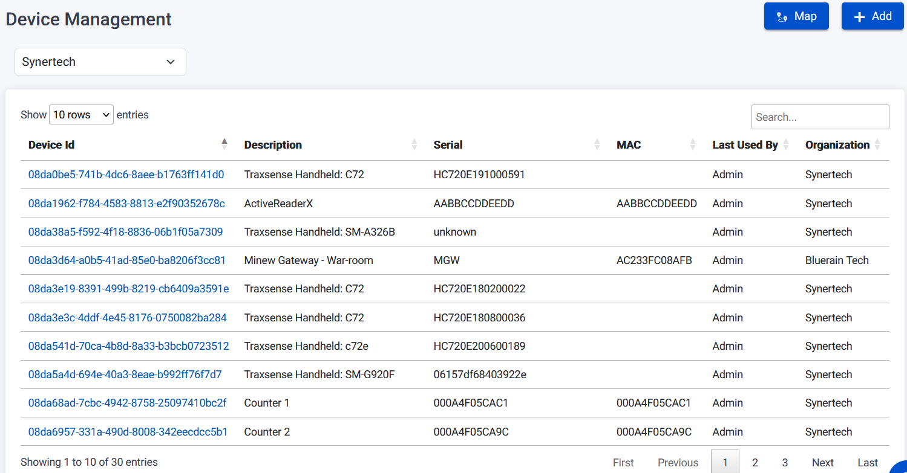
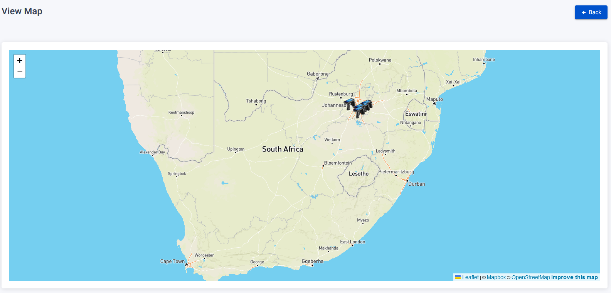
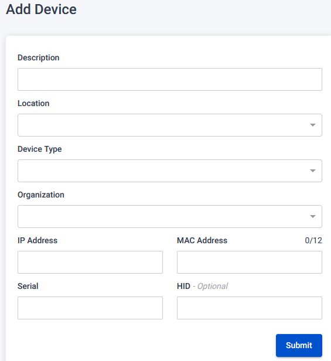
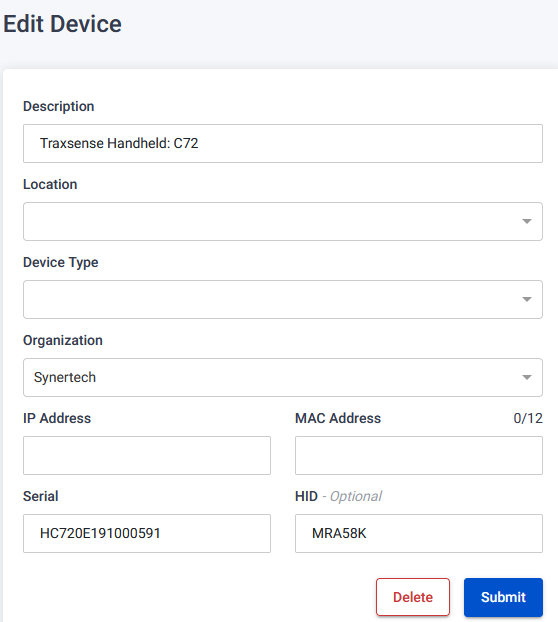

The Device Page supports device management and provides functionality to track the location of these devices and display their information on a map.

## Map button

To view and track the location of devices, follow these steps on the Device Page:

1. Click on the Map button.
2. You will be redirected to a map view that displays the locations of the devices.
3. The map will show where the devices are located, providing visual tracking of their positions.

## Add button

To register a new device, follow these steps on the Device Page:

1. Click on the Add button.
2. You will be presented with a form to add device details.
3. Fill in the required information, such as Description, Location, Device Type, Organization, IP Address, MAC Address, and Serial Number.
4. Optionally, you may choose to upload a file from your PC using the item CSV uploader.
5. Click Submit to register the device.

## Edit button

To edit an existing device, follow these steps on the Device Page:

1. Click on the clickable device ID link associated with the device you wish to edit.
2. You will be redirected to the Edit Device page.
3. Make the necessary changes to the device details, such as Description, Location, Device Type, Organization, IP Address, MAC Address, and Serial Number.
4. Click Submit to save the changes.

## Delete button

To delete a device, follow these steps on the Device Page:

1. Click on the clickable device ID link associated with the device you wish to delete.
2. You will be redirected to the Edit Device page.
3. Click on the Delete button.
4. A warning pop-up will be displayed to confirm the deletion.
5. Click the Confirm button to proceed with the device deletion.
