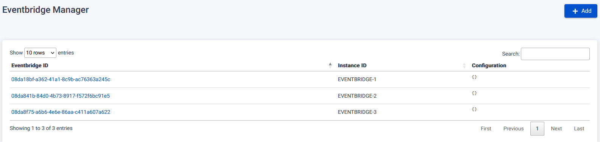
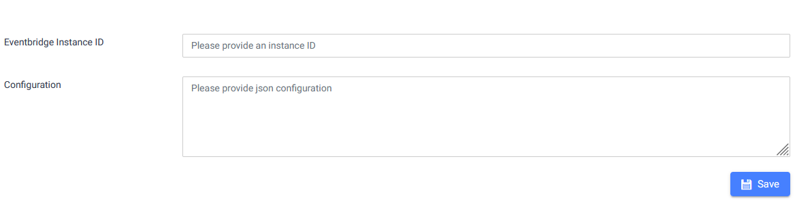
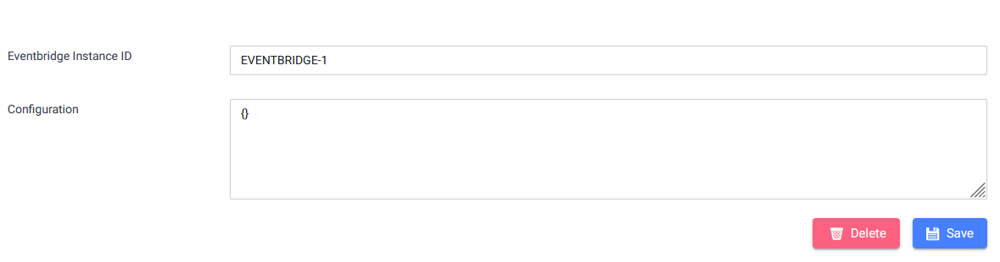
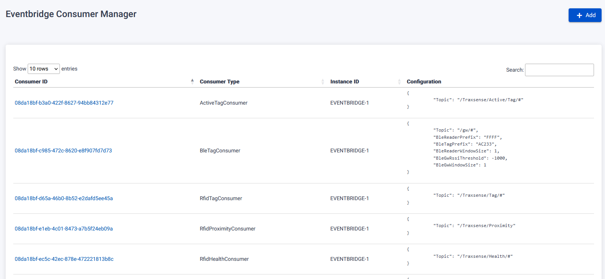
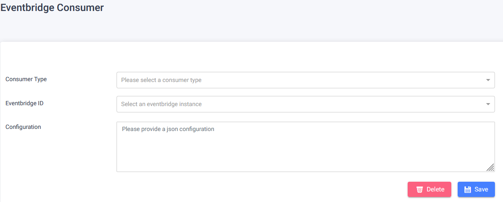
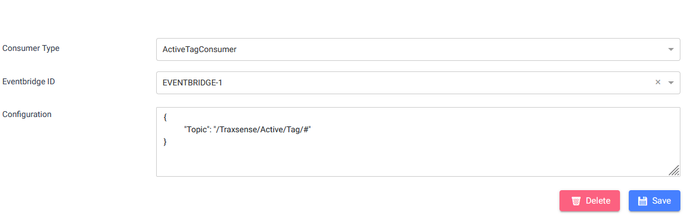

The Eventbridge Page manages events gathered from MQTT consumers.

## View & Search Events

On the Eventbridge Page, you can view and search for events associated with the system.

## Add New Event

The addition of a new event to the Eventbridge is configured by developers or administrators with knowledge of the system.

## Edit Event

Editing an existing event in the Eventbridge is configured by developers or administrators with knowledge of the system.

## Delete Event

Deleting an existing event from the Eventbridge is configured by developers or administrators with knowledge of the system.

## Eventbridge Consumer Page

The Eventbridge Consumer Page manages eventbridge consumers.

### View & Search Eventbridge Consumers

On the Eventbridge Consumer Page, you can view and search for eventbridge consumers associated with the system.

### Register New Eventbridge Consumer

Registering a new eventbridge consumer is configured by developers or administrators with knowledge of the system.

### Edit Eventbridge Consumer

Editing an existing eventbridge consumer is configured by developers or administrators with knowledge of the system.

### Delete Eventbridge Consumer

Deleting an existing eventbridge consumer is configured by developers or administrators with knowledge of the system.

