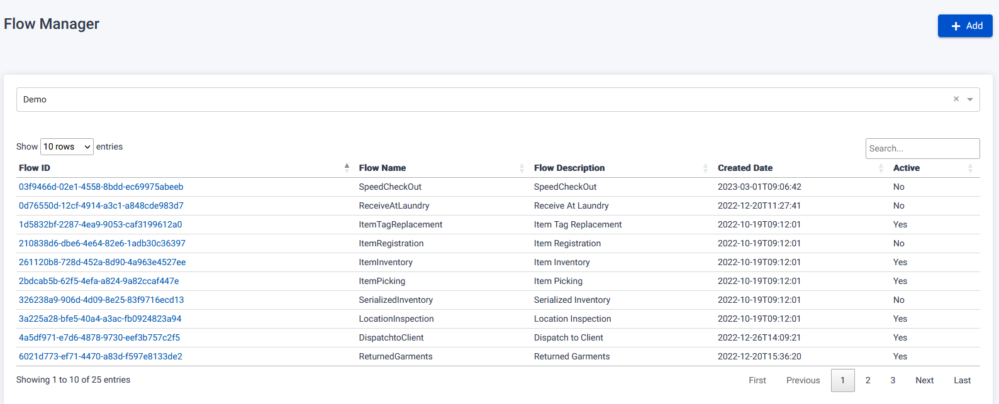
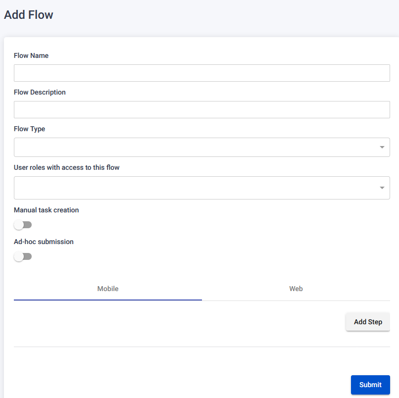
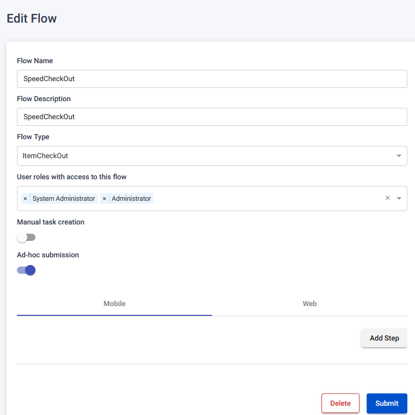
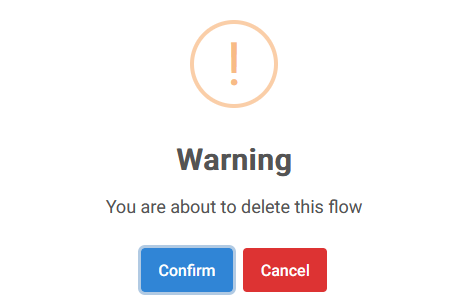

The Flows Page allows users to manage flows within the system.

## View & Search Flows by Organization

On the Flows Page, users can view a list of flows based on their organization or organizations they are permitted to view. Users can also filter flows using the search functionality.

## Add New Flow

To add a new flow, follow these steps:

1. On the Flows Page, click the "Add" button.
2. You will be redirected to the Add Flow page.
3. Fill in the required information:
   - Add Flow Name, Flow Description, Flow Type, User roles with access to this flow, Manual task creation, Ad-hoc submission.
4. Choose to click the "Add Flow Step" button to add flow steps:
   - You will be redirected to the Add Flow Step page.
   - Add Name, Description, Fragment, Active for the flow step.
5. Click the "Submit" button to register the new flow.
   

## Edit Flow

To edit an existing flow, follow these steps:

1. On the Flows Page, locate the flow you want to edit.
2. Click the clickable Flow Id link associated with the flow.
3. You will be redirected to the Edit Flow page.
4. Make the desired changes:
   - Change Flow Name, Flow Description, Flow Type, User roles with access to this flow, Manual task creation, Ad-hoc submission.
   - If flow steps were added:
     - Change Name, Description, Fragment, Active for each flow step.
5. Click the "Submit" button to save the changes.
   

## Delete Flow

To delete an existing flow, follow these steps:

1. On the Flows Page, locate the flow you want to delete.
2. Click the clickable Flow Id link associated with the flow.
3. You will be redirected to the Edit Flow page.
4. Click the "Delete" button.
5. A warning pop-up will appear.
6. Confirm the deletion by clicking the "Confirm" button.

