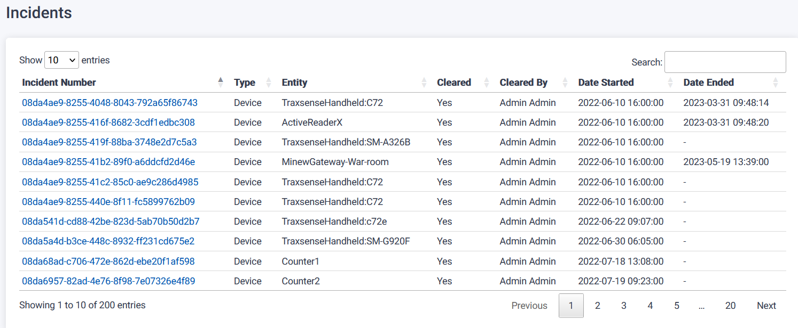
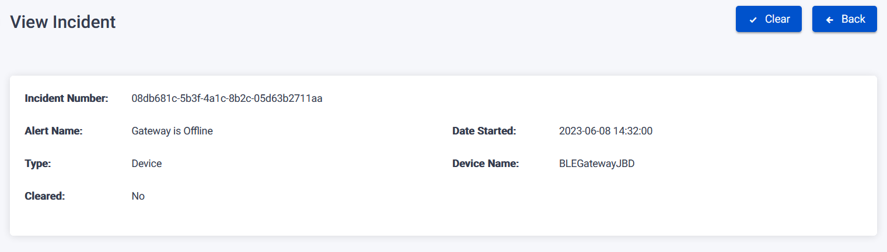

The Incidents Page serves as a documentation hub for events that disrupted normal operations and provides information on how those incidents were resolved.

## View Incidents

To view a specific incident, follow these steps on the Incidents Page:

1. Click on the clickable incident number.
2. You will be directed to the View Incident page, which presents a summary of the incident.
3. The page provides detailed documentation of the event that caused the disruption and outlines the resolution process.

## Clear incidents

On the Incidents Page, users have the ability to clear incidents by utilizing the Clear button.

To clear an incident, follow these steps on the Incidents Page:

1. Click on the Clear button associated with the incident in the table.
2. An "Add Note" pop-up will appear, allowing you to enter additional notes regarding the incident.
   

3. Choose to either save the note or skip adding a note.
4. The incident will be cleared and marked as resolved.
