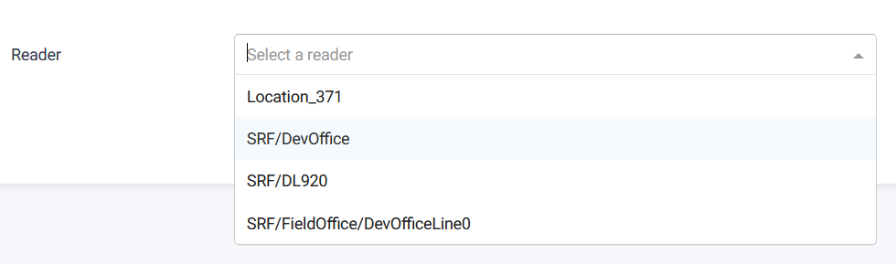
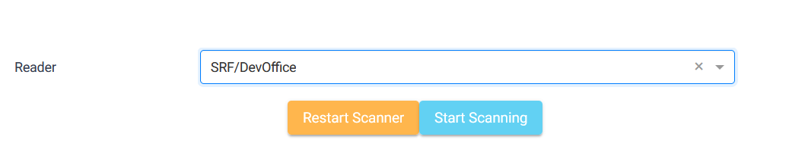
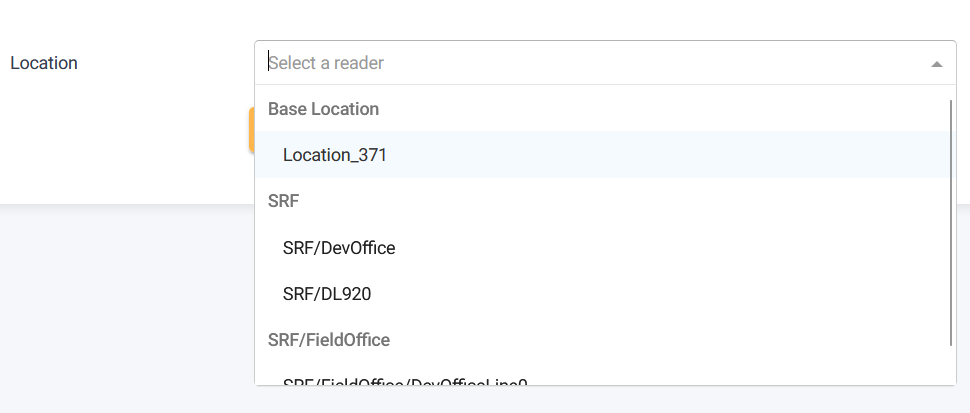
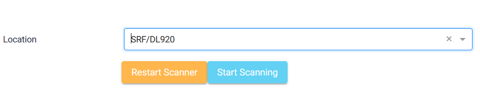

## Personnel Portal Page

The Personnel Portal Page offers the functionality to scan for items and display data related to the scanned items at a specific location portal.

### Start/Restart Scanner button

To scan for items, follow these steps on the Personnel Portal Page:

1. Select the location of a reader.
   

2. Click on the Start/Restart Scanner button.
   

3. The system will initiate the scanning process in the selected location and assign the scanned item to an employee ID if assigned. Otherwise, it will be categorized as 'notAssigned'.

## Portal Viewer Page

The Portal Viewer Page enables users to search for items and perform real-time scanning, with new scanned items added to the displayed list.

### Start/Restart Scanner button

To scan for items, follow these steps on the Portal Viewer Page:

1. Select the location of a reader.
   

2. Click on the Start/Restart Scanner button.
   

3. The system will initiate the scanning process in the selected location and display the scanned items in a data table.

## Portal Monitoring Page

The Portal Monitoring Page allows users to monitor portals and search for specific items associated with those portals.

### Location dropdown

To utilize the monitoring feature, follow these steps on the Portal Monitoring Page:

1. Select a portal from the location dropdown.
   

2. The page will load and refresh a DataTable, displaying items present at the selected portal.
   

3. Users can also search for specific items using available search functionalities.
4. Based on user permissions and item selections, users can navigate to the item history page for more detailed information.
