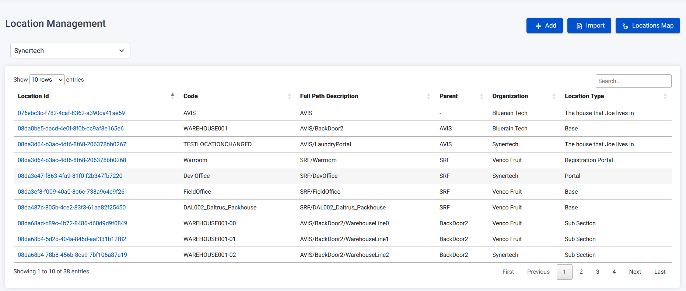
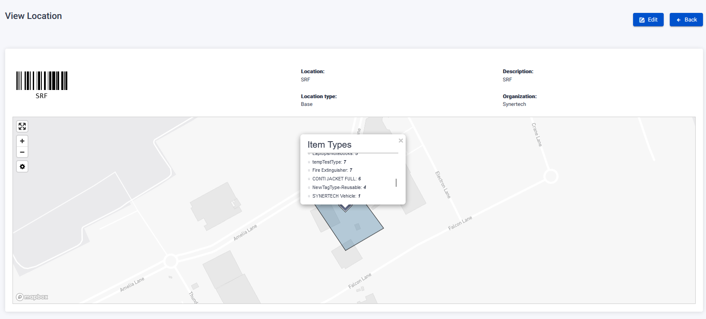
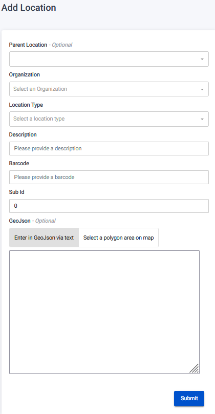
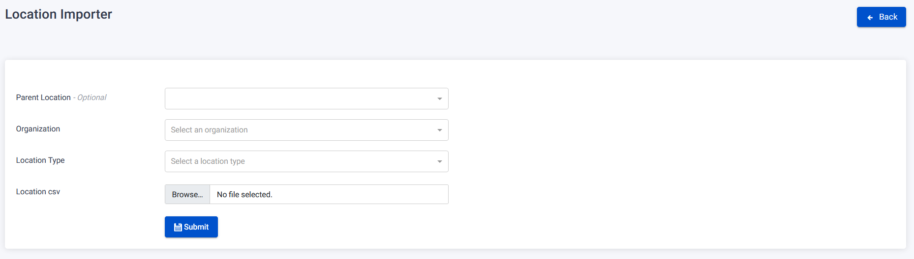
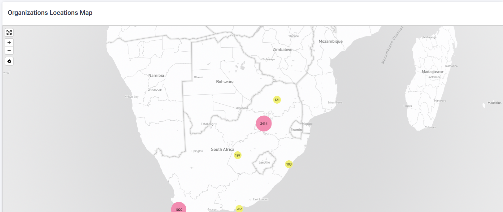

The Location Page provides a centralized view of locations along with their associated properties. Users can manage locations, view location details, add new locations, and edit existing locations.

## View Location

To view a specific location, follow these steps on the Location Page:

1. Click on the clickable Location Id.

2. You will be redirected to the View Location page, which provides a visual representation of the location.
   

3. If the location contains GeoJson, you can view a comprehensive list of items types found within that location.

4. Users have the ability to search for locations based on the organization.

### Add button

To add a new location, follow these steps on the Location Page:

1. Click on the Add button.
2. Fill in the required details such as Organization, Location Type, Description, Barcode, and optional GeoJson.
3. Optionally, add a Parent Location for hierarchical organization.
4. Click Save when all the information is provided.

### Edit button

To edit an existing location, follow these steps on the Location Page:

1. Click on a clickable Location Id in the Location Management table.
2. Click on the Edit button inside the location you wish to modify.
3. You will be redirected to the Edit Location page, where you can update the visual representation and information related to the location.
4. Make the necessary changes such as updating the Parent Location, Organization, Location Type, Description, Barcode, and optional GeoJson.
5. Save the changes once you have finished editing.

## Importer button

To add a new location using the importer, follow these steps on the Location Page:

1. Click on the Importer button.
2. Fill in the required details such as Organization and Location Type.
3. Upload a CSV file with the correct column structure for adding a location.
4. Optionally, add a Parent Location for hierarchical organization.
5. Click Save to import the locations from the CSV file.

### Location Map button

To view locations on a map, follow these steps on the Location Page:

1. Select a location from the dropdown menu.
2. A map will be displayed, showing the geographic distribution of items from the selected organization.
3. The map provides a visual representation of the locations and a list of items present at each location.
