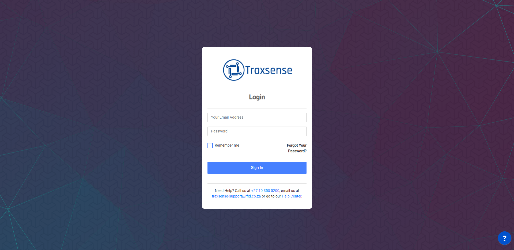
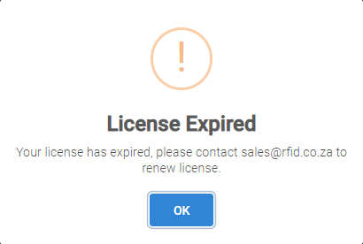
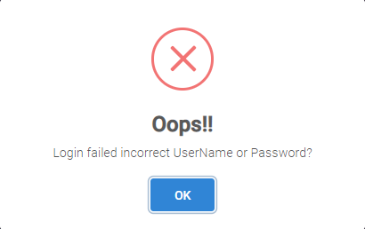
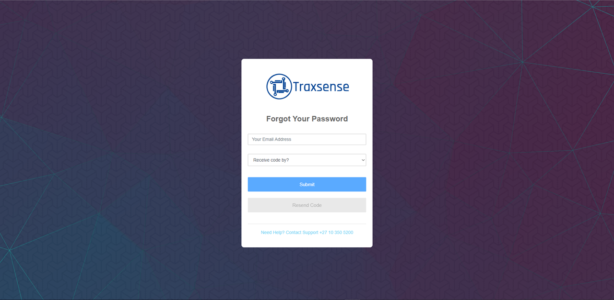
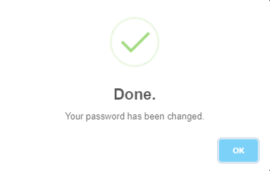
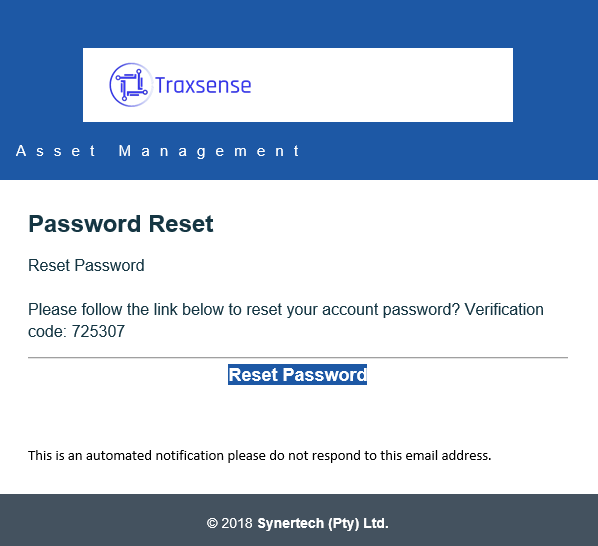
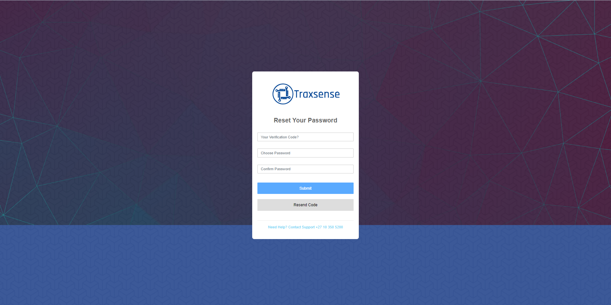
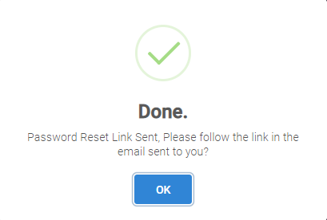
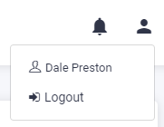

# Logging In

The version currently available can be accessed via a URL using one of the following supported web browsers:

- Google Chrome (and all Chromium based browsers)
- Mozilla Firefox
- Safari

Username and passwords for the Traxsense administrator will be emailed to the designated user.

In the Username field, type in your username or email address.
In the Password field, type in your password.

Click on the Login button.

Should you require any help click on the Help button  and a textbox will pop up in the corner

Type your query and a Service desk ticket will be created.
Once you have logged in the menu screen will be displayed.
Select the Menu item you wish to view by clicking on the menu item name.

## Traxsense License Expired

If your Traxsense license is expired, the following error message will be displayed:

Click on the Ok button to return to the Login screen.

## Forgotten Password

Should you click on Login without entering a username or password the following error message will be displayed.

Click on the Ok button to return to the Login screen.

If you have forgotten your password, click on the Forgot Password button, the following screen is displayed:

Enter your email address and select the method you would like to receive the link/One Time Pin to reset your password then click on the Submit button.

The following message will be displayed:

Click on the Ok button to return to the Login screen.

An OTP will be emailed to you to reset your password.

Click once on the Reset Password hyperlink and the user will be redirected to the web URL to complete the password reset process.

Enter the OTP and create a new password in the text box provided, then click on the Submit button, the following message will be displayed:

Click on the Ok button to return to the Login screen.

## Logging Out

To exit the application, click on the User icon on the top right-hand side of the screen, the Logout button will be displayed.
