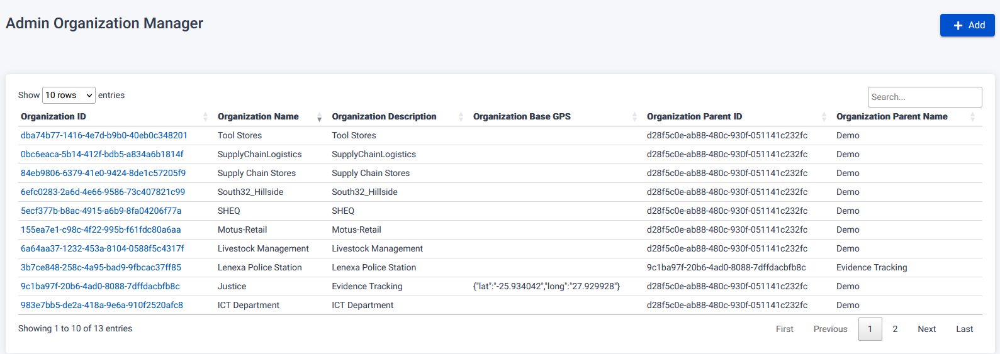
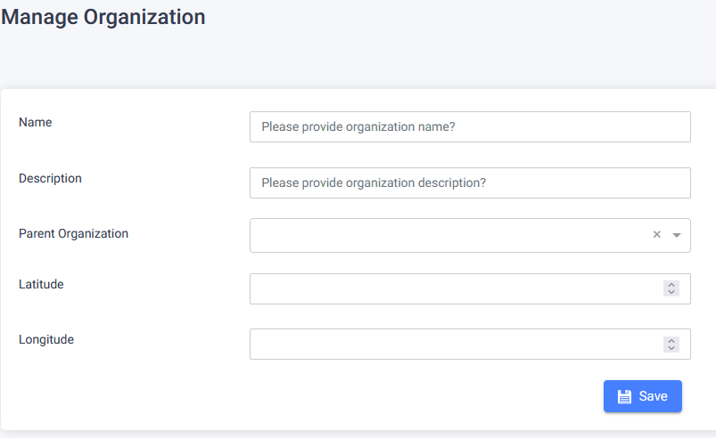
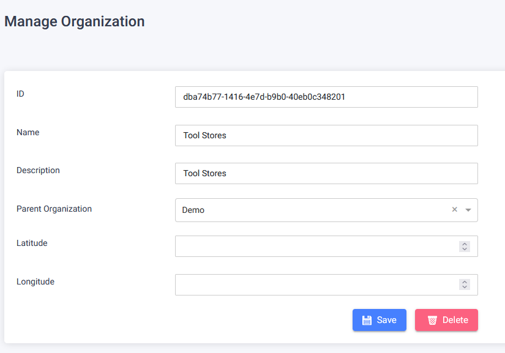

The Organizations Page provides functionalities for managing organizations and their relationships.

## Register New Organization

To register a new organization, follow these steps:

1. On the Admins Page, click the "Add" button.
2. You will be redirected to the Manage Organization page.
3. Fill in the required information:
   - Add Name, Description, Parent Organization, and optionally Latitude and Longitude.
4. Click the "Save" button to register the new organization.
   

## Edit Organization

To edit an existing organization, follow these steps:

1. On the Admins Page, locate the organization you want to edit.
2. Click the clickable Organization Id link associated with the organization.
3. You will be redirected to the Manage Organization page.
4. Make the desired changes:
   - Change Name, Description, Parent Organization.
   - Optionally, add/change Latitude and Longitude.
5. Click the "Save" button to save the changes.
   

## Delete Organization

To delete an existing organization, follow these steps:

1. On the Admins Page, locate the organization you want to delete.
2. Click the clickable Organization Id link associated with the organization.
3. You will be redirected to the Manage Organization page.
4. Click the "Delete" button.
5. A warning pop-up will appear.
6. Confirm the deletion by clicking the "Confirm" button.

