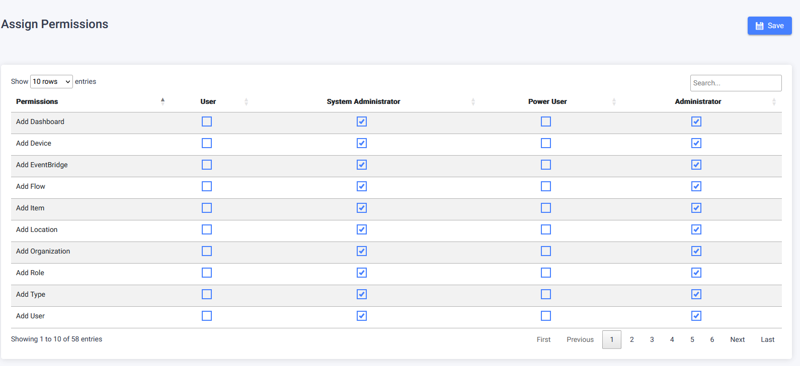

Permissions are utilized to control access to sensitive information, ensuring that only appropriate users can view specific content. User roles determine which users can access certain features, as permissions are assigned to these roles. By limiting data visibility for specific users, security is enhanced, and the user interface remains uncluttered by hiding irrelevant sections. Permissions can be categorized into four main types: View, Add, Edit, and Delete.

## View Permissions

1. View Dashboard: Allows users to access the dashboard section in the side menu and view any configured monitoring or reporting dashboards.
2. View Item Tracking: Grants access to the item tracking section in Traxsense's side menu.
3. Portal Viewer: Enables users to view and utilize the portal viewer page.
4. Personal Tracking Portal: Permits users to view and use the personal tracking portal section in Traxsense.
5. View Alerts: Allows users to examine the details of triggered alerts within Traxsense.
6. View Incidents: Provides users with the ability to view the incidents page.
7. View Location: Allows users to access location-related pages and guards against unauthorized access to locations on other pages. Without this permission, forms requiring location selection will be unusable, which can also cause issues on mobile devices when location scanning or dropdowns are involved.
8. View Item: Enables users to view the item management table and item history page. Without this permission, users will be unable to see item details anywhere within Traxsense, including mobile devices that involve item scanning and modification.
9. View Device: Used to allow users to view devices in Traxsense. This permission does not apply to Traxsense mobile.
10. View Type: Gives users access to view item types, statuses, and related information in the type management section. This permission is required for mobile users to see dropdowns containing types.
11. Vehicle Management: Grants permission to view vehicle data in Traxsense web.
12. View Metabase Reports: Provides access to the reports section in Traxsense, similar to the dashboard permission.
13. Role Manager: Allows users to view roles in Traxsense web.
14. Manage Permissions: Enables users to assign permissions to user roles.
15. Administrative Management: Grants access to the administrative section in Traxsense's side menu, which includes various high-level features.
16. Admin Settings: Gives access to Traxsense settings, such as the configuration of mobile reader settings.
17. View Organization: Allows users to view organization data and prevents unauthorized access to organization data in dropdowns on mobile devices.
18. EventBridge Manager: Provides access to view the configured EventBridges and EventBridge consumers in Traxsense.
19. View Flows: Allows users to view configured flows used for task creation.
20. Manage Rules: Grants access to view, create, edit, and delete automation rules in Traxsense.
21. User Management: Provides access to the user management page and ensures visibility of relevant user dropdowns.

## Add Permissions

1. Add Dashboard: Allows users to link new dashboards to Traxsense for display and add reports to the reports section.
2. Add Location: Grants access to the Add Location page and the ability to register new locations.
3. Add Device: Provides the ability to add new devices (fixed readers) via the Add Device page.
4. Create Task: Enables users to create tasks for execution within the Traxsense mobile application.
5. Add Type: Allows users to register new types via the Add Type page.
6. Add Vehicle: Provides the ability to register new vehicles through the Add Vehicle page.
7. Add User: Enables the registration of new users via the Add User page.
8. Add Role: Allows the registration of new roles via the Add Role page.
9. Add Organization: Grants access to the Add Organizations page for registering new organizations.
10. Add Eventbridge: Provides access to the Add Eventbridge and Add Eventbridge consumers pages for registering new EventBridges and EventBridge consumers.
11. Add Flow: Allows users to register new flows via the Add Flow page.

## Edit Permissions

1. Edit Dashboard: Provides access to the Edit Dashboard page for modifying existing dashboards.
2. Edit Location: Enables editing of existing locations via the Edit Location page.
3. Edit Device: Allows editing of existing devices (fixed readers) through the Edit Device page.
4. Edit Task: Enables editing of existing tasks, including task cancellation.
5. Edit Type: Provides access to the Edit Type page for modifying existing types.
6. Edit Vehicle: Allows editing of existing vehicles via the Edit Vehicle page.
7. Edit User: Enables editing of existing users through the Edit User page.
8. Edit Role: Provides access to the Edit Role page for modifying existing roles.
9. Edit Organization: Allows editing of existing organizations via the Edit Organizations page.
10. Edit Eventbridge: Provides access to the Edit Eventbridge and Edit Eventbridge consumers pages for modifying existing EventBridges and EventBridge consumers.
11. Edit Flow: Allows editing of existing flows through the Edit Flow page.
12. Clear Incident: Enables users to mark incidents as cleared, indicating that the issue has been resolved.

## Delete Permissions:

1. Delete Dashboard: Allows users to delete existing dashboards.
2. Delete Location: Enables the deletion of existing locations.
3. Delete Device: Allows the deletion of existing devices (fixed readers).
4. Remove Type: Provides the ability to delete existing types.
5. Delete Vehicle: Allows the deletion of existing vehicles.
6. Delete User: Enables the deletion of existing users.
7. Delete Role: Allows the deletion of existing roles.
8. Delete Organization: Enables the deletion of existing organizations.
9. Delete Eventbridge: Allows the deletion of existing EventBridges and EventBridge consumers.
10. Delete Flow: Enables the deletion of existing flows.

## Permissions for Mobile:

Permissions can significantly impact the mobile user experience. The minimum recommended permissions for mobile-only users are: View Item, View Type, View Location, View User, and View Organization. Without these permissions, users may encounter issues with dropdowns while executing tasks on mobile devices.
