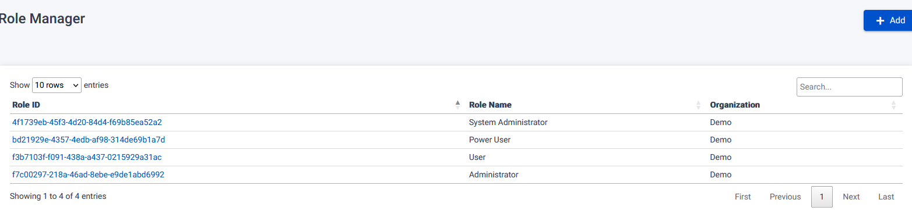
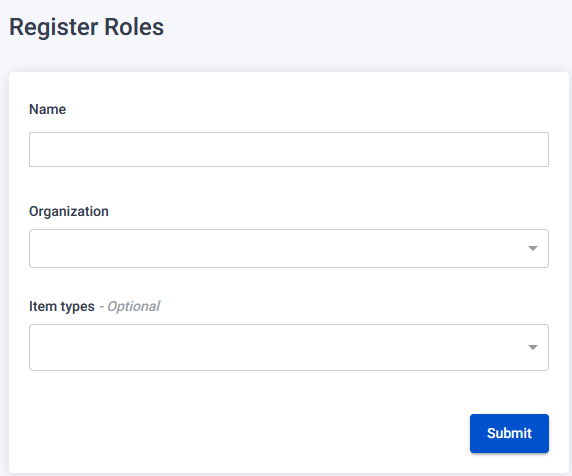
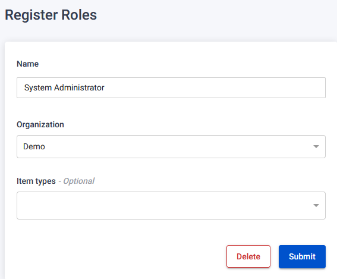

The Role Page allows administrators to manage user roles within the system.

## Register New Role

To register a new role, follow these steps:

1. On the Role Page, click the "Add" button.
2. You will be redirected to the Register Roles page.
3. Fill in the required information:
   - Add Name, Organization, and optionally specify Item Types.
4. Click the "Submit" button to register the new role.
   

## Edit Role

To edit an existing role, follow these steps:

1. On the Role Page, locate the role you want to edit.
2. Click the clickable name link associated with the role.
3. You will be redirected to the Register Roles page.
4. Make the desired changes:
   - Change Name, Organization, and optionally add/change Item Types.
5. Click the "Submit" button to save the changes.

## Delete Role

To delete an existing role, follow these steps:

1. On the Role Page, locate the role you want to delete.
2. Click the clickable RoleId link associated with the role.
3. You will be redirected to the Register Roles page.
4. Click the "Delete" button.
5. A warning pop-up will appear.
6. Confirm the deletion by clicking the "Confirm" button.
