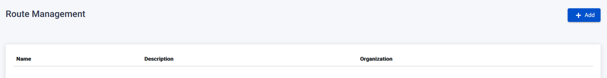
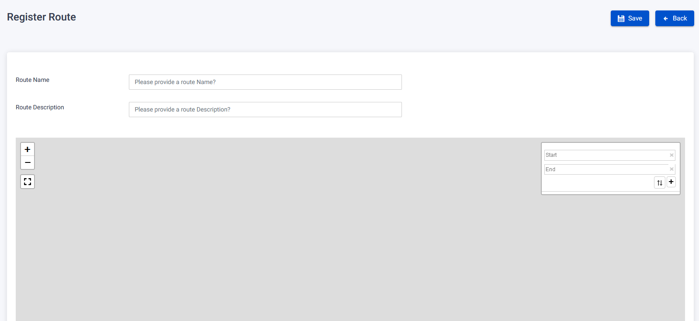

The Route Page provides functionalities for managing routes in the system.

## Register Route

To register a new route, follow these steps:

1. On the Route Page, click the "Add" button.
2. You will be redirected to the Register Route page.
3. Fill in the required fields:
   - Route Name: Enter the name of the route.
   - Route Description: Provide a description for the route.
   - Start and End points on the map: Specify the start and end points of the route on the map.
4. Click the "Save" button to register the new route.
   

## Edit Route

To edit an existing route's details, follow these steps:

1. On the Route Page, locate the route you want to edit.
2. Click on the route's name link to be redirected to the Edit Route page.
3. Modify the desired fields:
   - Route Name: Change the name of the route.
   - Route Description: Update the description of the route.
   - Start and End points on the map: Modify the start and end points of the route on the map.
4. Click the "Submit" button to save the changes.

## Delete Route

To delete a route, follow these steps:

1. On the Route Page, locate the route you want to delete.
2. Click on the route's name link to be redirected to the Edit Route page.
3. Click the "Delete" button.
4. A warning pop-up will appear.
5. Confirm the deletion by clicking the "Confirm" button.
