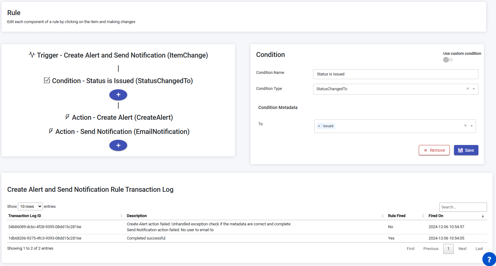

The Rule Engine Page manages rules within the system.

### Add New Rule

To add a new rule, follow these steps:

1. On the Rule Engine Page, click the "Add Rule" button.
2. Fill in the required information:
   - Add Rule Name, Trigger Type.
   - Choose to either activate the rule or not.
3. Click the "Trigger Addition" button.
4. Add conditions by providing Condition Name, Condition Type, and Condition Metadata.
5. Add actions by providing Action Name, Action Type, and Action Metadata.
6. Click the "Save" button to register the new rule.

### Edit Rule

To edit an existing rule, follow these steps:

1. On the Rule Engine Page, locate the rule you want to edit.
2. Click the clickable Rule Id link associated with the rule.
3. You will be redirected to the Rule Editor page.
4. Make the desired changes:
   - Change Name, Trigger Type by clicking on the Trigger section.
   - Change Condition Name, Condition Type, Condition Metadata by clicking on the Condition section.
   - Change Action Name, Action Type, Action Metadata by clicking on the Action section.
5. Click the "Save" button to save the changes.
6. Active Rule create transaction log when executed.
   - Each transaction log has the following details:
      - Transaction Log ID.
      - Description: Either 'Completed sucsseful' or the list of actions that failed.
      - Rule Fiered: Indating that all actions were executed.
      - Fired On: The date and time of execution

## Rule engine conditions

**Item Category:**

| ConditionType                 | Description                                                                        |
| ----------------------------- | ---------------------------------------------------------------------------------- |
| LocationChangedFrom           | Condition if the item movement condition is satisfied                              |
| LocationChangedTo             | Condition if the item movement condition is satisfied                              |
| ChangedFromHierarchy          | Condition if the item movement condition is satisfied                              |
| ChangedToHierarchy            | Condition if the item movement condition is satisfied                              |
| StatusChangedTo               | Condition if the item movement condition is satisfied                              |
| StatusChangedFrom             | Condition if the item movement condition is satisfied                              |
| AssignedToChanged             | Condition if the item assignment change condition is satisfied                     |
| ItemMetadataChanged           | Condition if the item metadata change condition is satisfied                       |
| ItemTypeEqualTo               | Condition if the item type condition is satisfied                                  |
| StatusEqualTo                 | Condition if the status condition is satisfied                                     |
| LocationEqualTo               | Condition if the location condition is satisfied                                   |
| UsesEqualTo                   | Condition if the item uses condition is satisfied                                  |
| AssignedTo                    | Condition if the item assignment condition is satisfied                            |
| LastSeenGreaterThan           | Condition if the item's last seen date is older than the specified minutes         |
| LastSeenSmallerThan           | Condition if the item's last seen date is newer than the specified minutes         |
| TimeInGreaterThan             | Condition if the time seen in the specified minutes                                |
| StatusChangedGreaterThan      | Condition if item status changed over a specified period                           |
| ItemCreatedAfter              | Condition if item was created over a specified period                              |
| ItemConditionValueLessThan    | Condition if the value of a condition in the condition log is less than a value    |
| ItemConditionValueGreaterThan | Condition if the value of a condition in the condition log is greater than a value |
| ItemConditionValueEqualTo     | Condition if the value of a condition in the condition log is equal to a value     |
| ItemMetadataEqualTo           | Condition if the value of item metadata is equal to a value                        |
| ItemMetadataLessThan          | Condition if the value of item metadata is less than a value                       |
| ItemMetadataGreaterThan       | Condition if the value of item metadata is greater than a value                    |
| ItemMetadataDateAfter         | Condition if the value of item metadata is greater than a value                    |
| ItemMetadataDateBefore        | Condition if the value of item metadata is greater than a value                    |
| TaskOlderThan                 | Condition if a task has been open for longer than a specific amount of days        |

**Device Category:**

| ConditionType     | Description                                                                  |
| ----------------- | ---------------------------------------------------------------------------- |
| DeviceOffline     | Condition if the Device's last seen date is newer than the specified minutes |
| OfflineLessThan   | Condition if the Device's last seen date is older than the specified minutes |
| DeviceIdEqualTo   | Condition if the DeviceId condition is satisfied                             |
| DeviceTypeEqualTo | Condition if the Device type condition is satisfied                          |

**Task Category:**

| ConditionType                 | Description                                                             |
| ----------------------------- | ----------------------------------------------------------------------- |
| FlowEquals                    | Condition if a specific task is submitted                               |
| TaskLastDoneGreaterThan       | Condition if the last time a task was done is older than a given time   |
| TaskConditionValueLessThan    | Condition if the value of a condition in a task is less than a value    |
| TaskConditionValueGreaterThan | Condition if the value of a condition in a task is greater than a value |
| TaskConditionValueEqualTo     | Condition if the value of a condition in a task is equal to a value     |

## Rule Engine Actions

**Item Category:**

| Action Type                        | Description                                                                                                      |
| ---------------------------------- | ---------------------------------------------------------------------------------------------------------------- |
| ArchiveItemTransLog                | Archive Item Transactions logs that are older than a specified date                                              |
| ChangeItemStatus                   | Changes the status of an item                                                                                    |
| ChangeLocation                     | Change location of an item                                                                                       |
| SignalTowerRestItem                | Signal tower REST API integration with item details                                                              |
| ImportOAuth2MicrosoftDynamicsItems | Import Items from Microsoft Dynamics using OAuth 2.0 to authenticate                                             |
| IncrementUses                      | Increments Uses every time an item is used                                                                       |
| CreateAlert                        | Creates an Alert                                                                                                 |
| MqttTagAlert                       | Creates Mqtt Tag Alert                                                                                           |
| EmailNotification                  | Sends an email notification on item change                                                                       |
| ItemEmailToOrganization            | Sends an email notification on item change to all users in the items organization and the organizations above it |
| AssignedToEmail                    | Sends an email notification when item is assigned                                                                |
| AssignedFromEmail                  | Sends an email notification when item is unassigned                                                              |
| UpdateDescription                  | Update the description of an item based on values of specific metadata fields                                    |
| UpdateMetadataFields               | Update metadata fields of an item                                                                                |
| SetMetadataDate                    | Update metadata fields of an item                                                                                |
| CreateItemInspection               | Create an item inspection task based on a schedule                                                               |
| CreateItemInventoryTask            | Create an item Inventory task based on a schedule or task submission                                             |
| CancelTask                         | Cancel a task                                                                                                    |

**Vehicle Category:**

| Action Type          | Description                                                 |
| -------------------- | ----------------------------------------------------------- |
| ArchiveVehicleEvents | Archive Vehicle events that are older than a specified date |

**Users Category:**

| Action Type   | Description                    |
| ------------- | ------------------------------ |
| SyncLdapUsers | Sync Ldap users with Traxsense |

**Device Category:**

| Action Type               | Description                                                                                              |
| ------------------------- | -------------------------------------------------------------------------------------------------------- |
| DeviceEmail               | Send an email notification about device state                                                            |
| DeviceEmailToOrganization | Send an email notification about device state to the devices organization and the organizations above it |

**Incident Category:**

| Action Type   | Description       |
| ------------- | ----------------- |
| ClearIncident | Clear an incident |

**Report Category:**

| Action Type     | Description                     |
| --------------- | ------------------------------- |
| AutomatedReport | Sends email of Automated Report |

**Task Category:**

| Action Type             | Description                                                          |
| ----------------------- | -------------------------------------------------------------------- |
| TaskItemStatusChange    | Change status of items from the task                                 |
| CreatePickingTask       | Create a picking task based on the scanned items                     |
| CreateItemInventoryTask | Create an item Inventory task based on a schedule or task submission |
| CancelTask              | Cancel a task                                                        |
