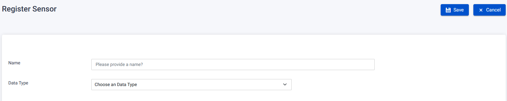

The Sensor Page provides functionalities for managing sensors in the system.

## Register Sensor

To register a new sensor, follow these steps:

1. On the Sensor Page, click the "Add" button.
2. You will be redirected to the Register Sensor page.
3. Fill in the required fields:
   - Name: Enter the name of the sensor.
   - Data Type: Specify the data type for the sensor.
4. Click the "Save" button to register the new sensor.
   
