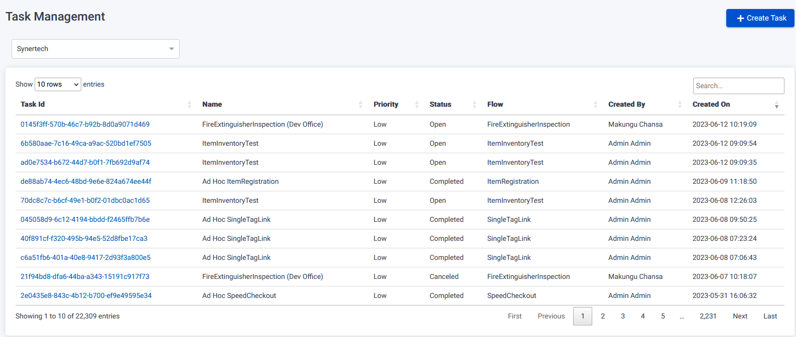
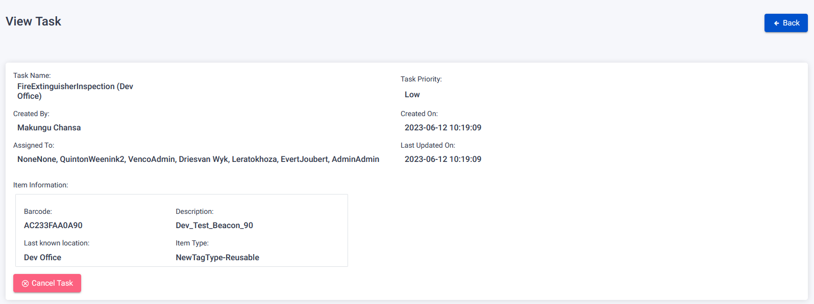
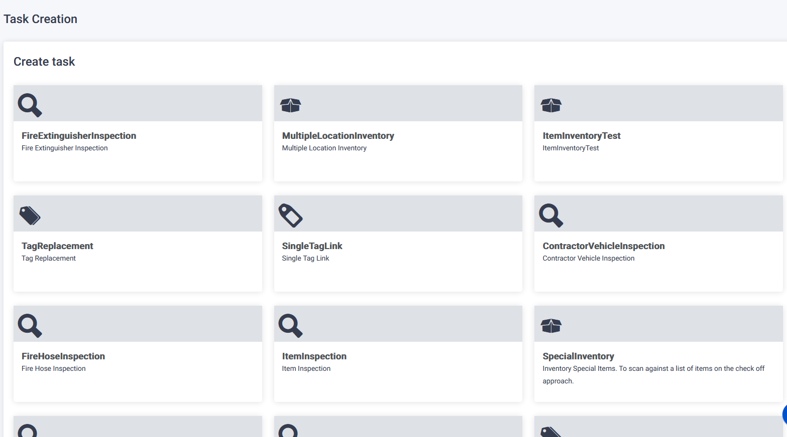
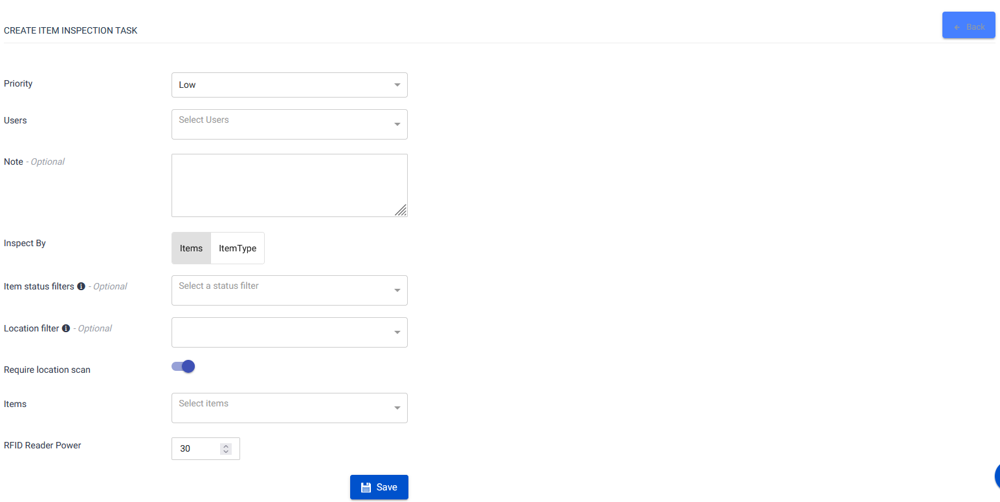
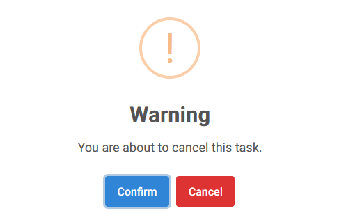
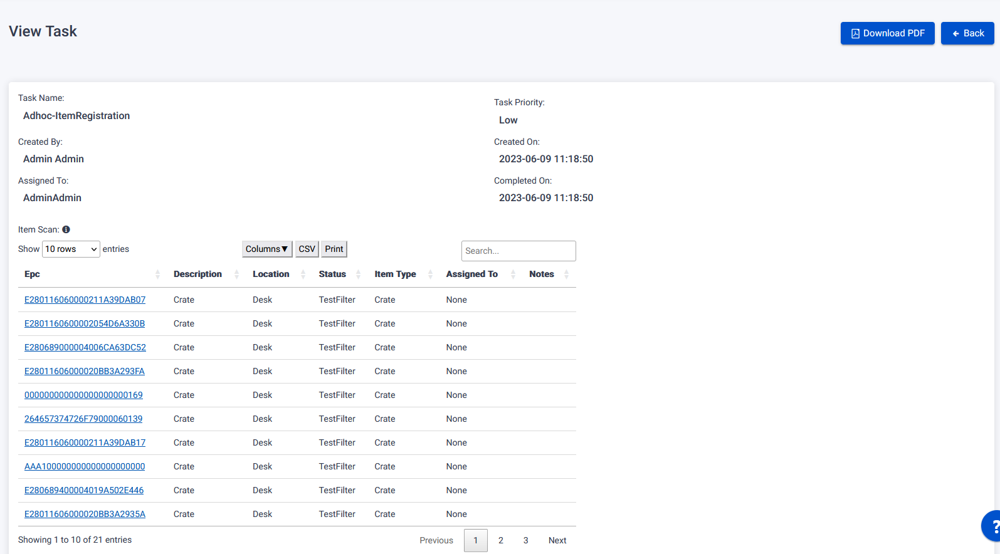

The Task Page supports task management, including CRUD operations (Create, Read, Update, Delete), task assignment to multiple users, and task execution using an RFID scanner or web interface.

## Task Management

To view a task, follow these steps on the Task Page:

1. Click on the clickable Task Id link associated with the task you want to view.
2. You will be redirected to the View Task Page.
3. The View Task Page displays comprehensive information about the selected task.

## Create Task

To create a new task, follow these steps on the Task Page:

1. Click on the Create Task button.
2. You will be directed to the Task Type selection page.
3. Fill in the necessary details to create the task.
   
4. Click on the Create Task button to create the task.

## Cancel Task button

To cancel an opened task, follow these steps on the Task Page:

1. Click on the clickable Task Id link associated with the task you want to delete.
2. You will be redirected to the View Task Page.
3. Select the cancel task button at the bottom of the task.
4. Confirm the pop up to cancel the Task.

## Download PDF button

To download a PDF file of a task, follow these steps on the Task Page:

1. Click on a COMPLETED Task's Task Id that you want to download as a PDF.
2. You will be redirected to the View Task Page.
3. Click on the Download PDF button.
4. A PDF file of the task will be downloaded to your device.
