The Type Management section of the system provides administrators with web-based interfaces to easily create, edit, and manage different statuses, types, and configurations of items, transactions, and devices within the system.

## Item Status Management

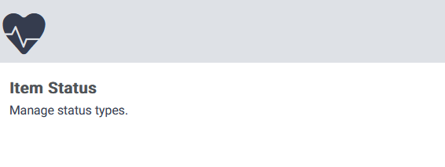

### View Item Status

To view a list of Item Status types, follow these steps:

1. Click on the Item Status option within Types.
2. You will be redirected to the Item Status Management page, where you can view the item types.
   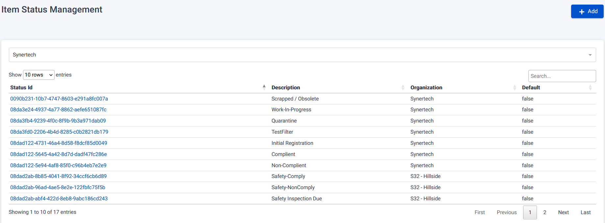

### Add Item Status

To add a new item status type, follow these steps:

1. On the Item Status Management page, click the "Add" button.
2. Fill in the required fields.
3. Click the "Save" button to create the new item status.
   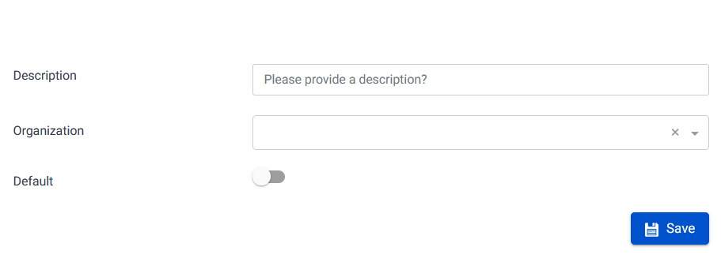

### Edit Item Status

To edit an existing item status type, follow these steps:

1. On the Item Status Management page, locate the item status you want to edit.
2. Click Status Id of the status you wish to edit.
3. You will be redirected to the Edit Item Status page.
4. Modify the desired fields.
5. Click the "Save" button to save the changes.
   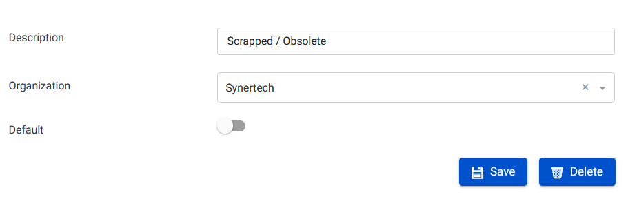

### Delete Item Status

To delete an existing item status type, follow these steps:

1. On the Item Status Management page, locate the item status you want to edit.
2. Click Status Id of the status you wish to edit.
3. You will be redirected to the Edit Item Status page.
4. Click on the "Delete" button next to the item status.
5. A warning pop-up will appear.
6. Confirm the deletion by clicking the "Confirm" button.
   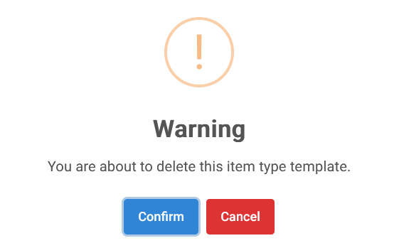

## Item Type Management

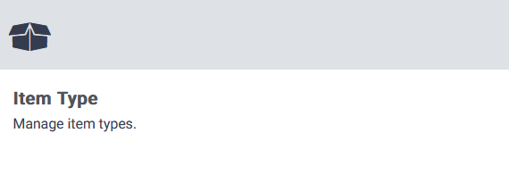

### View Item Types

To view a list of Item Types, follow these steps:

1. Click on the Item Types option within Types.
2. You will be redirected to the Item Status Management page, where you can view the item types.
   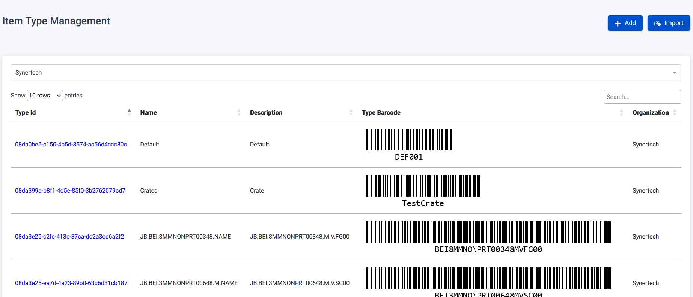

### Import Item Types

The Item Type importer allows for the bulk adding of multiple Item Types from a csv.
You need to place all these Item Types within a single organization.

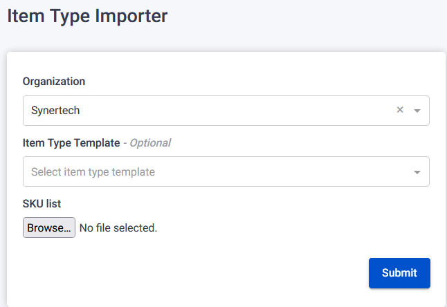

### Add Item Type

To add a new item type, follow these steps:

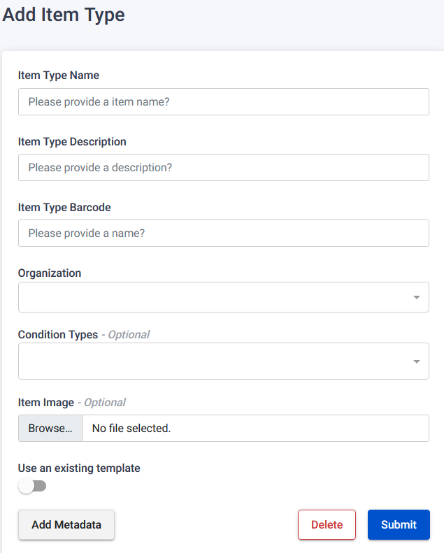{align=right}

1. On the Item Type Management page, click the "Add" button.
2. Provide the following details for the new item type:
   - Item Type Name: Enter the name of the item type.
   - Item Type Description: Add a description for the item type.
   - Item Type Barcode: Specify the barcode for the item type.
   - Organization: Select the organization associated with the item type.
   - Optional Condition Types: Add or modify any optional condition types.
   - Optional Item Image: Attach an optional image for the item type.
   - Use an existing template or Add Metadata: Choose either to use an existing template or add metadata.

If using an existing template:

- Select the desired item type template.

If adding metadata:

- Provide the Field Name, Data Type, and Default Value.

1. Click the "Submit" button to create the new item type.

### Edit Item Type

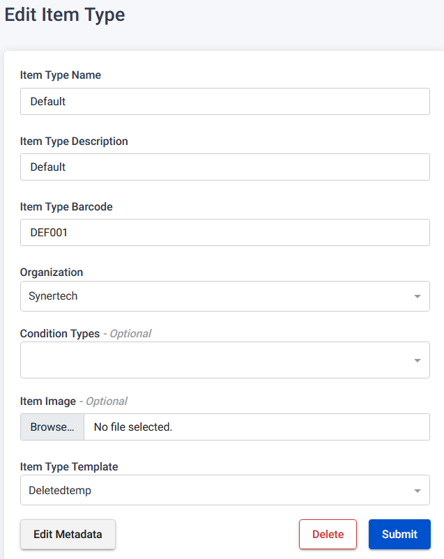{align=right}

To edit an existing item type, follow these steps:

1. On the Item Type Management page, locate the item type you want to edit.
2. Click Type Id of the type you wish to edit.
3. You will be redirected to the Edit Item Type page.
4. Modify the desired fields:

- Item Type Name: Change the name of the item type.
  - Item Type Description: Update the description of the item type.
  - Item Type Barcode: Modify the barcode associated with the item type.
  - Organization: Change the organization associated with the item type.
  - Optional Condition Types: Add or modify any optional condition types.
  - Optional Item Image: Attach a new or updated image for the item type.
  - Use an existing template or Add Metadata:
    - If using an existing template:
      - Select a different item type template if desired.
    - If adding metadata:
      - Change the Field Name, Data Type, and Default Value as needed.

5. Click the "Submit" button to save the changes.

### Delete Item Type

To delete an existing item type, follow these steps:

1. On the Item Type Management page, locate the item type you want to delete.
2. Click Type Id of the type you wish to delete.
3. You will be redirected to the Edit Item Type page.
4. Click on the "Delete" button in the item type form.
5. A warning pop-up will appear. You can optionally also delete the Item Type template associated with the Item Type.
6. Confirm the deletion by clicking the "Confirm" button.
   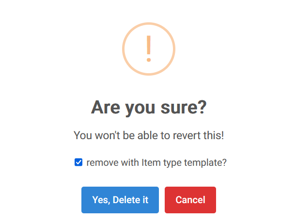

## Item Type Template Management

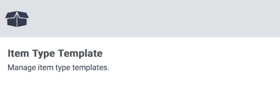

### View Item Type Templates

To view a list of Item Types Templates, follow these steps:

1. Click on the Item Types Templates option within Types.
2. You will be redirected to the Item Types Templates Management page, where you can view the item type templates.  
   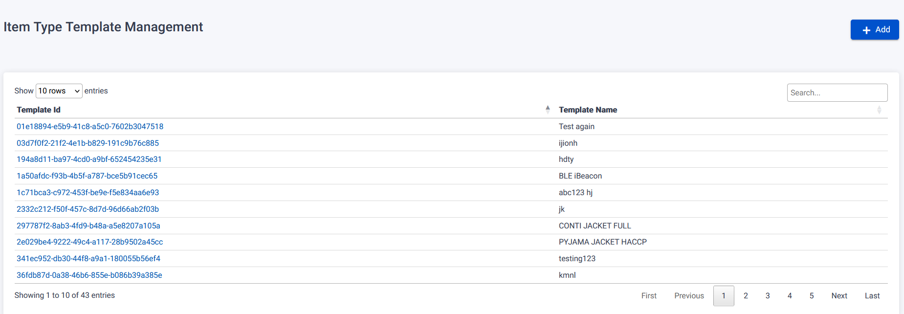

### Add Item Type Template

To add a new item type template, follow these steps:

1. On the Item Type Template Management page, click the "Add" button.
2. Fill in the required fields.
3. Click the "Save" button to create the new item type template.
   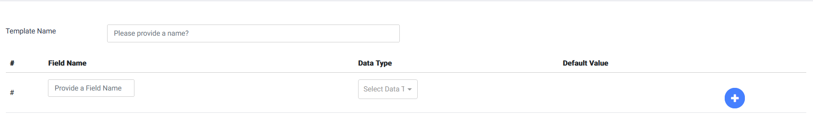

### Edit Item Type Template

To edit an existing item type template, follow these steps:

1. On the Item Type Template Management page, locate the item type template you want to edit.
2. Click Template Id of the type you wish to edit.
3. You will be redirected to the Edit Item Type Template page.
4. Modify the desired fields.
5. Click the "Save" button to save the changes.
   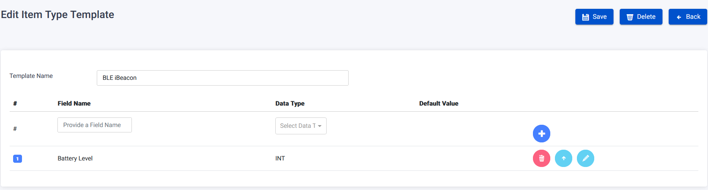

### Delete Item Type Template

To delete an existing item type template, follow these steps:

1. On the Item Type Template Management page, locate the item type template you want to edit.
2. Click Template Id of the type you wish to edit.
3. You will be redirected to the Edit Item Type Template page.
4. Click on the "Delete" button next to the template.
5. A warning pop-up will appear.
6. Confirm the deletion by clicking the "Confirm" button.
   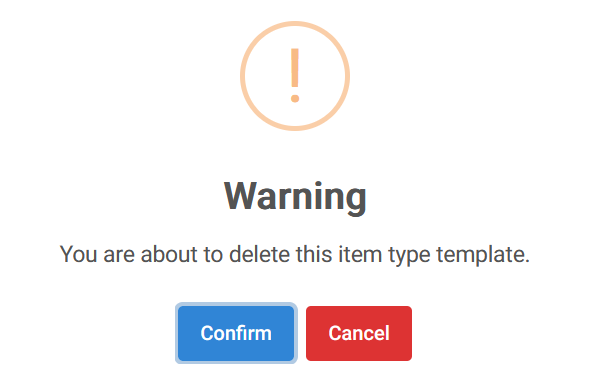

## Tag Type

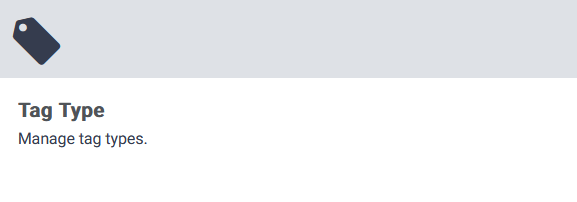

### View Tag Type

To view a list of Tag Type types, follow these steps:

1. Click on the Tag Type option within Types.
2. You will be redirected to the Tag Type Management page, where you can view the Tag types.
   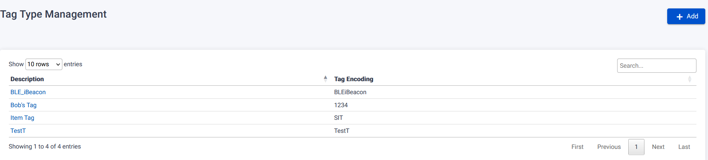

### Add Tag Type

To add a new Tag Type, follow these steps:

1. On the Tag Type Management page, click the "Add" button.
2. Fill in the required fields.
3. Click the "Save" button to create the new item type template.
   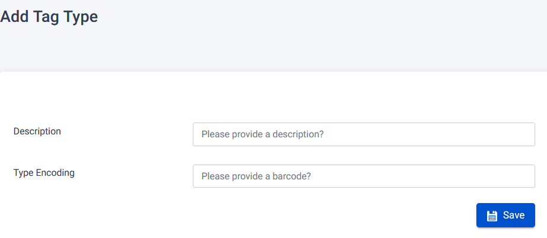

### Edit Tag Type

To edit an existing Tag Type, follow these steps:

1. On the Tag Type Management page, locate the tag type you want to edit.
2. Click on the Description of the Tag Type you wish to edit.
3. You will be redirected to the Edit Tag Type page.
4. Modify the desired fields.
5. Click the "Save" button to save the changes.
   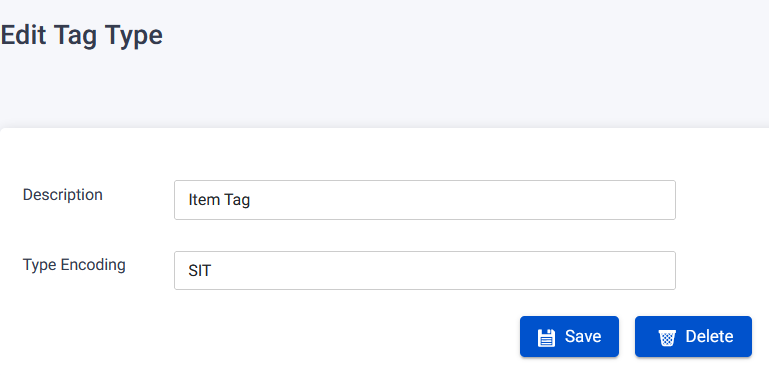

### Delete Tag Type

To delete an existing Tag Type, follow these steps:

1. On the Tag Type Management page, locate the tag type you want to delete.
2. Click on the Description of the Tag Type you wish to delete.
3. You will be redirected to the Edit Tag Type page.
4. Click on the "Delete" button next to the template.
5. A warning pop-up will appear.
6. Confirm the deletion by clicking the "Confirm" button.
   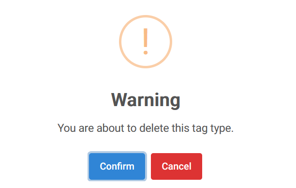

## Transaction Type

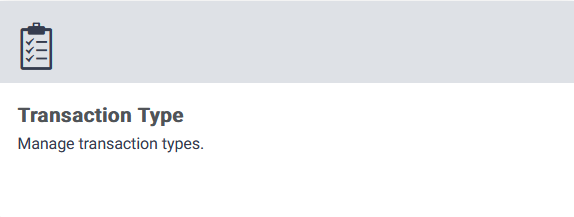

### View Transaction Type

To view a list of Transaction Types, follow these steps:

1. Click on the Transaction Type option within Types.
2. You will be redirected to the Transaction Type Management page, where you can view the Transaction Types.
   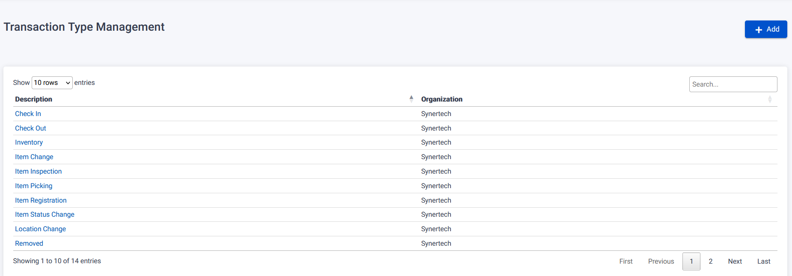

### Add Transaction Type

To add a new Transaction Type, follow these steps:

1. On the Transaction Type Management page, click the "Add" button.
2. Fill in the required fields.
3. Click the "Save" button to create the new Transaction Type.
   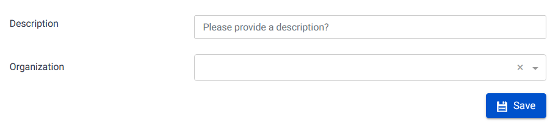

### Edit Transaction Type

To edit an existing Transaction Type, follow these steps:

1. On the Transaction Type Management page, locate the Transaction Type you want to edit.
2. Click on the Description of the Transaction Type you wish to edit.
3. You will be redirected to the Edit Tag Type page.
4. Modify the desired fields.
5. Click the "Save" button to save the changes.
   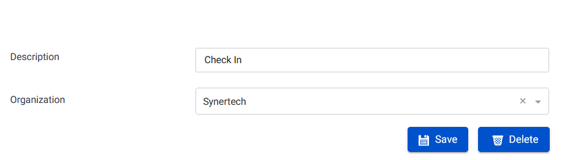

### Delete Transaction Type

To delete an existing Transaction Type, follow these steps:

1. On the Transaction Type Management page, locate the Transaction Type you want to delete.
2. Click on the Description of the Transaction Type you wish to delete.
3. You will be redirected to the Edit Transaction Type page.
4. Click on the "Delete" button next to the template.
5. A warning pop-up will appear.
6. Confirm the deletion by clicking the "Confirm" button.
   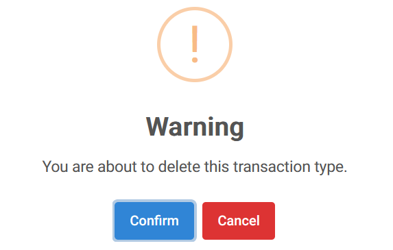

## Vehicle Types

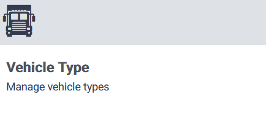

### View Vehicle Types

To view a list of Vehicle Types, follow these steps:

1. Click on the Vehicle Types option within Types.
2. You will be redirected to the Vehicle Types Management page, where you can view the Vehicle Types.
   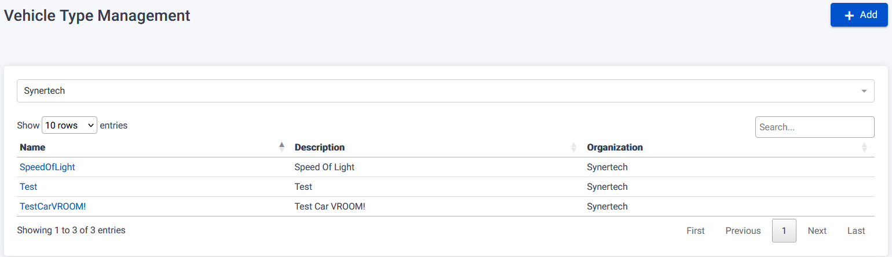

### Add Vehicle Types

To add a new Vehicle Types, follow these steps:

1. On the Vehicle Types Management page, click the "Add" button.
2. Fill in the required fields.
3. Click the "Save" button to create the new Vehicle Types.

### Edit Vehicle Types

To edit an existing Vehicle Types, follow these steps:

1. On the Vehicle Types Management page, locate the Vehicle Types you want to edit.
2. Click on the Name of the Vehicle Types you wish to edit.
3. You will be redirected to the Edit Vehicle Type page.
4. Modify the desired fields.
5. Click the "Save" button to save the changes.

### Delete Vehicle Types

To delete an existing Vehicle Types, follow these steps:

1. On the Vehicle Types Management page, locate the Vehicle Types you want to delete.
2. Click on the Name of the Vehicle Types you wish to delete.
3. You will be redirected to the Edit Vehicle Type page.
4. Click on the "Delete" button next to the template.
5. A warning pop-up will appear.
6. Confirm the deletion by clicking the "Confirm" button.

## Alert Types

### View Alert Types

To view a list of Alert Types, follow these steps:

1. Click on the Alert Types option within Types.
2. You will be redirected to the Alert Types Management page, where you can view the Alert Types.
   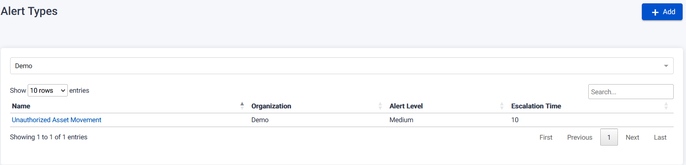

### Add Alert Types

To add a new alert type, follow these steps:

1. Provide the Name, Description, Organization, Alert Level, and Escalation Time in Minutes.
2. Click the Save button to save the alert type.
   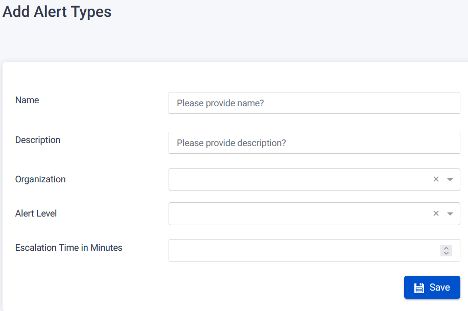

### Edit Alert Types

To edit an existing Alert Types, follow these steps:

1. On the Alert Types Management page, locate the Alert Types you want to edit.
2. Click on the Name of the Alert Types you wish to edit.
3. You will be redirected to the Edit Alert Types page.
4. Modify the desired fields.
5. Click the "Save" button to save the changes.
   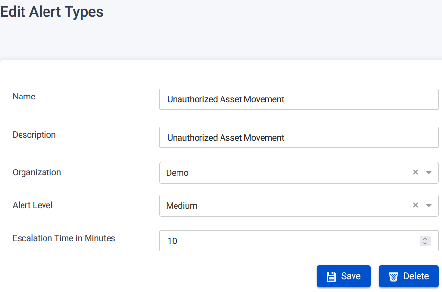

### Delete Alert Types

To delete an existing Alert Types, follow these steps:

1. On the Alert Types Management page, locate the Alert Types you want to delete.
2. Click on the Name of the Alert Types you wish to delete.
3. You will be redirected to the Edit Alert Types page.
4. Click on the "Delete" button next to the template.
5. A warning pop-up will appear.
6. Confirm the deletion by clicking the "Confirm" button.
   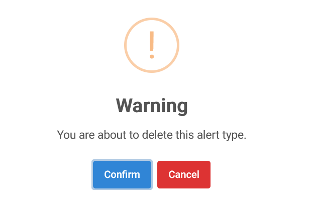

## Location Type Management

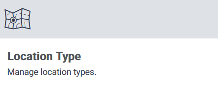

### View Location Types

To view a list of Location Types, follow these steps:

1. Click on the Location Types option within Types.
2. You will be redirected to the Location Types Management page, where you can view the Location Types.
   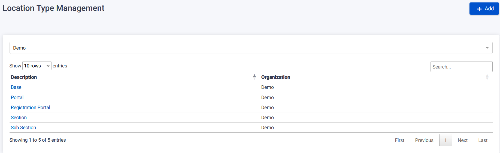

### Add Location Type

To add a new location type, follow these steps:

1. Click the Add button.
2. Enter the Name, Description, and Organization for the location type.
3. Click the Save button to save the location type.
   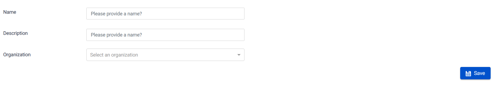

### Edit Location Type

To edit a location type, follow these steps:

1. Click on the Location Type Id link associated with the location type you want to edit. You will be redirected to the Add Location Type page.
2. Modify the Name, Description, or Organization as needed.
3. Click the Save button when you're done to update the location type.
   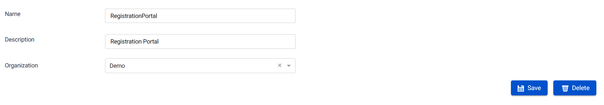

### Delete Location Type

To delete a location type, follow these steps:

1. Click on the Location Type Id link associated with the location type you want to delete. You will be redirected to the Add Location Type page.
2. Click the Delete button. A warning pop-up will appear.
3. Click the Confirm button to proceed with the deletion.
   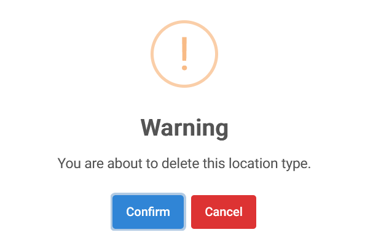

## Device Type Management

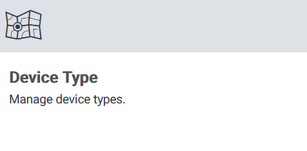

### View Device Types

To view a list of Location Types, follow these steps:

1. Click on the Location Types option within Types.
2. You will be redirected to the Location Types Management page, where you can view the Location Types.
   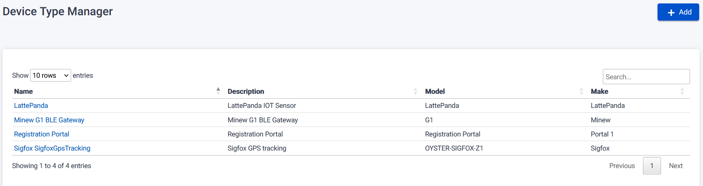

### Add Device Type

To add a new device type, follow these steps:

1. Click the Add button.
2. Enter the Name, Description, Make, and Model for the device.
3. Click the Save button to save the device type.
   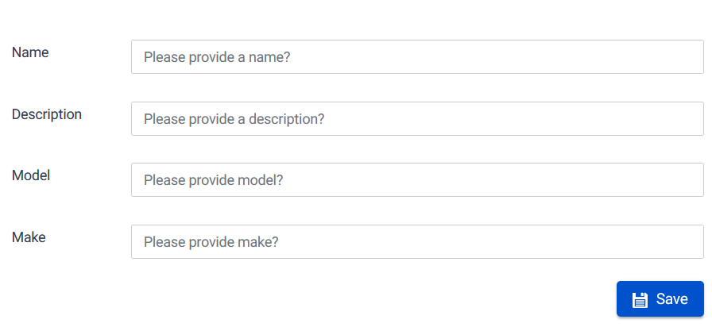

### Edit Device Type

To edit a device type, follow these steps:

1. Click on the Name link associated with the device type you want to edit. You will be redirected to the Edit Device Type page.
2. Modify the Name, Description, Make, or Model as needed.
3. Click the Save button when you're done to update the device type.
   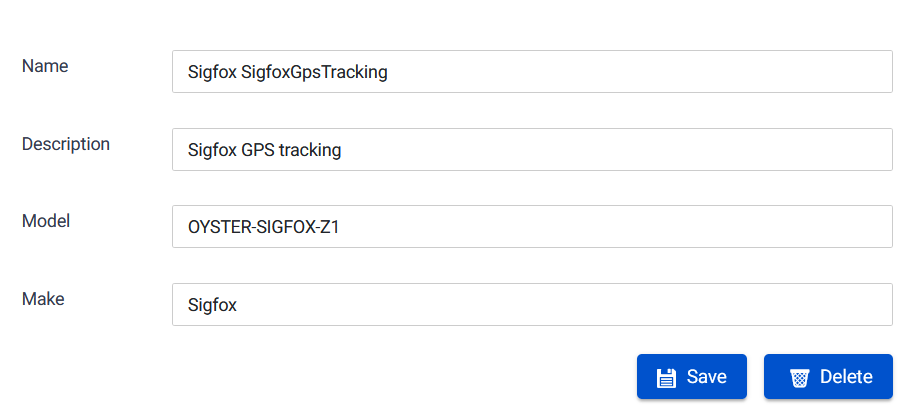

### Delete Device Type

To delete a device type, follow these steps:

1. Click on the Name link associated with the device type you want to delete. You will be redirected to the Edit Device Type page.
2. Click the Delete button. A warning pop-up will appear.
3. Click the Confirm button to proceed with the deletion.
   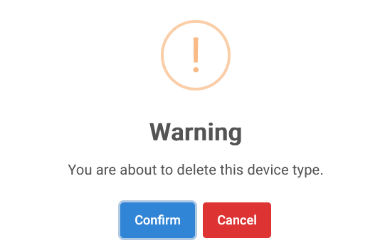

## Condition Types

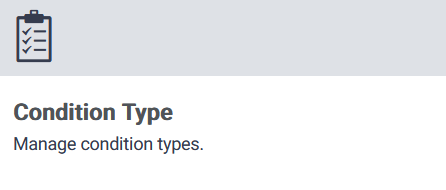

### View Condition Types

To view a list of Condition Types, follow these steps:

1. Click on the Condition Types option within Types.
2. You will be redirected to the Condition Types Management page, where you can view the Condition Types.
   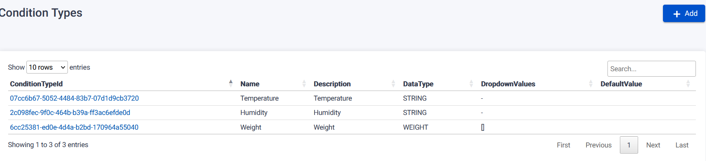

### Add Condition Types

To add a new condition type, follow these steps:

1. Click the Add button.
2. Enter the Condition Type Name, Condition Type Description, and Data Type.
3. Click the Submit button when you're done to save the condition type.
   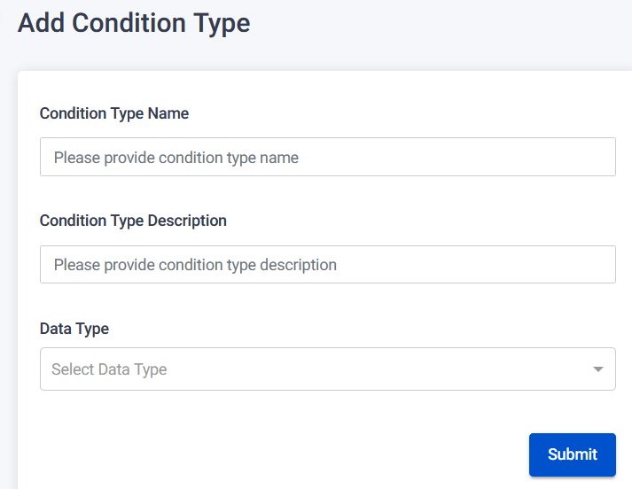

### Edit Condition Types

To edit a condition type, follow these steps:

1. Click on the ConditionTypeId link associated with the condition type you want to edit. You will be redirected to the Edit Condition Type page.
2. Modify the Condition Type Name, Condition Type Description, or Data Type as needed.
3. Click the Submit button when you're done to update the condition type.
   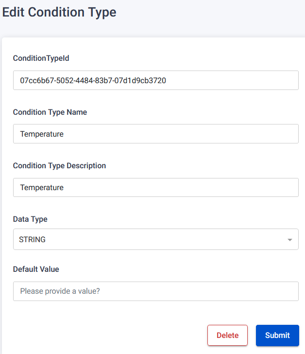

### Delete Condition Types

To delete a condition type, follow these steps:

1. Click on the Name link associated with the condition type you want to delete. You will be redirected to the Edit Condition Type page.
2. Click the Delete button. A warning pop-up will appear. 3. Click the Confirm button to proceed with the deletion.

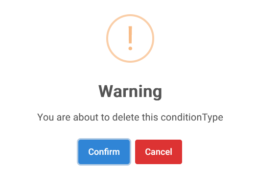
