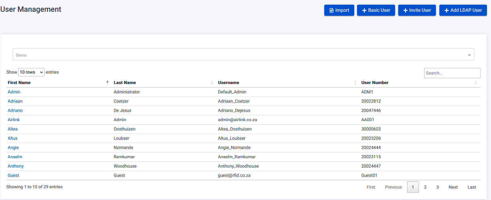
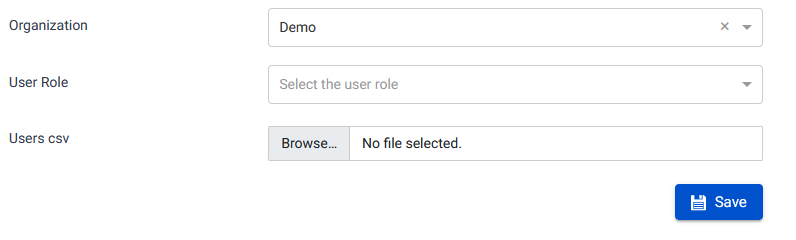
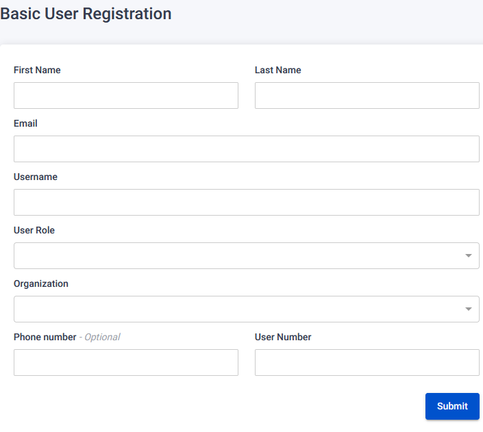
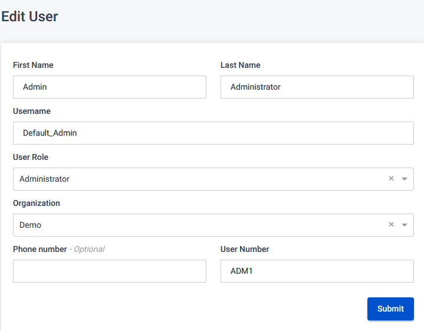
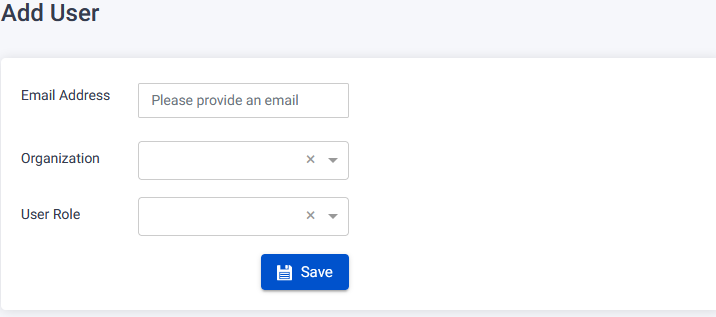
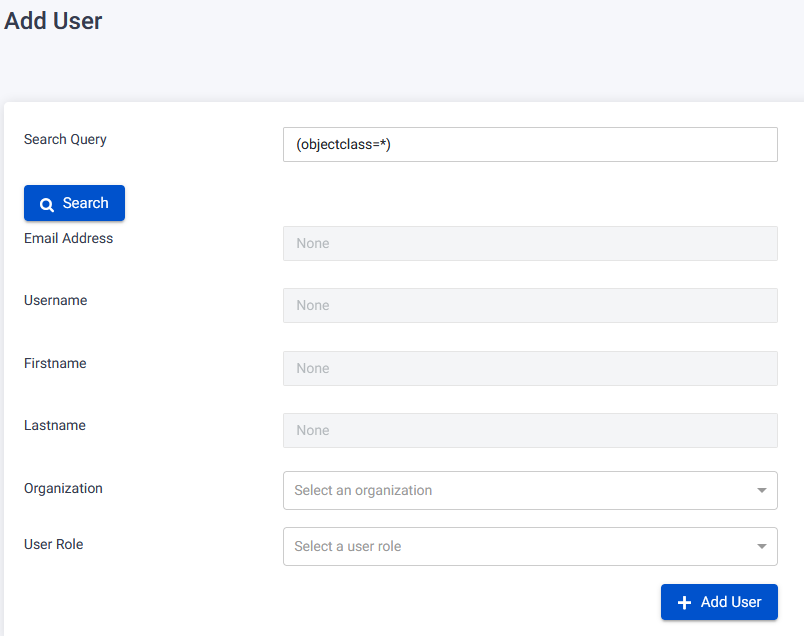

The User Page provides functionalities for managing user accounts within the system.

## Import Users

To import users using an importer, follow these steps:

1. On the User Page, click the "Import" button.
2. You will be redirected to the Import Users page.
3. Fill in the required information:
   - Add Organization, User Role, and select a Users CSV file from your PC using the uploader.
4. Click the "Save" button to import the users.
   

## Add Basic User

To add a basic user, follow these steps:

1. On the User Page, click the "Basic User" button.
2. You will be redirected to the Register User page.
3. Fill in the required information:
   - Add First Name, Last Name, Email, Username, User Role, Organization, Phone number (optional), User Number.
4. Click the "Submit" button to register the new user.
   

## Edit User

To edit an existing user, follow these steps:

1. On the User Page, locate the user you want to edit.
2. Click the clickable name link associated with the user.
3. You will be redirected to the Edit User page.
4. Make the desired changes:
   - Change Username, First Name, Last Name, Organization, User Role, User Number.
   - Optionally, add/change the Phone Number.
5. Click the "Submit" button to save the changes.
   

## Delete User

To delete an existing user, follow these steps:

1. On the User Page, locate the user you want to delete.
2. Click the clickable name link associated with the user.
3. You will be redirected to the Edit User page.
4. Click the "Delete" button.
5. A warning pop-up will appear.
6. Confirm the deletion by clicking the "Confirm" button.

## Invite User

To add a user via invite, follow these steps:

1. On the User Page, click the "Invite User" button.
2. You will be redirected to the Invite User page.
3. Fill in the required information:
   - Add Email Address, Organization, User Role.
4. Click the "Submit" button to register the new user via invite.
   

## Add LDAP User

To add a user via an LDAP server, follow these steps:

1. On the User Page, click the "LDAP User" button.
2. You will be redirected to the Add LDAP User page.
3. To register an LDAP user, you have two options:
   - Option 1: Enter Search Query parameters and click the "Search" button.
   - Option 2: Fill in the required information - Email Address, Username, First Name, Last Name, Organization, User Role.
4. Click the "Add User" button when done.
   
