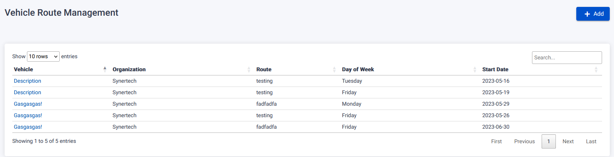
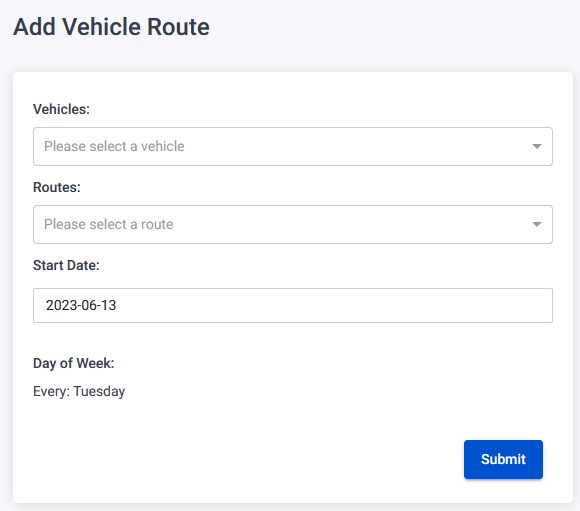
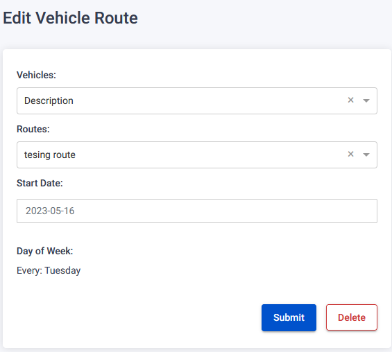
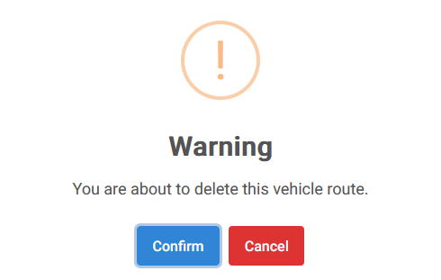

The Vehicle Routes Page provides functionalities for managing vehicle routes in the system.

## Register Vehicle Route

To register a new vehicle route, follow these steps:

1. On the Vehicle Routes Page, click the "Add" button.
2. You will be redirected to the Register Vehicle Route page.
3. Fill in the required fields.
4. Click the "Save" button to register the new vehicle route.
   

## Edit Vehicle Route

To edit an existing vehicle route, follow these steps:

1. On the Vehicle Routes Page, locate the route you want to edit.
2. Click on the route's name link to be redirected to the Edit Vehicle Route page.
3. Modify the desired fields.
4. Click the "Save" button to save the changes.

## Delete Vehicle Route

To delete an existing vehicle route, follow these steps:

1. On the Vehicle Routes Page, locate the route you want to edit.
2. Click on the route's name link to be redirected to the Edit Vehicle Route page.
3. You will be redirected to the Edit Vehicle Route page.
4. Click on the "Delete" button next to the Vehicle Route.
5. A warning pop-up will appear.
6. Confirm the deletion by clicking the "Confirm" button.

