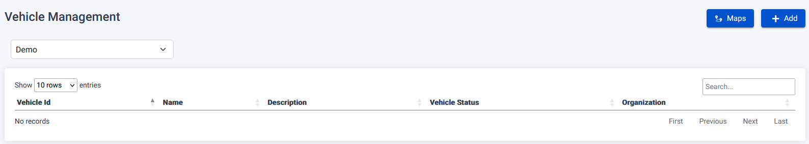
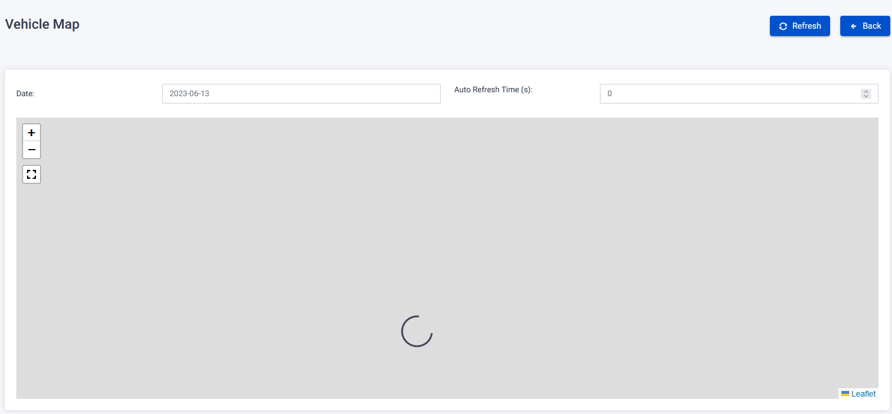
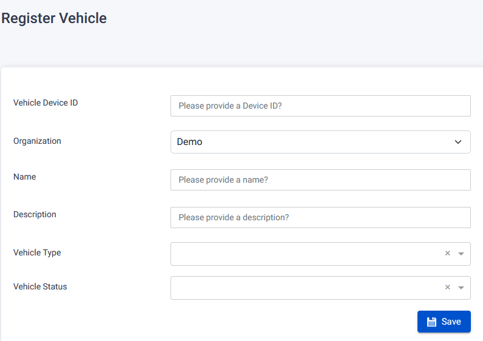

The Vehicles Page provides functionalities for managing vehicles in the system.

## Vehicle Map

The Vehicle Map feature allows users to view a map with a visual representation of vehicles.

To view the Vehicle Map, follow these steps:

1. On the Vehicles Page, click the "Map" button.
2. You will be redirected to the Vehicle Map page, where a map view showing the vehicles will be displayed.
   

## Refresh Vehicles

The Refresh button allows users to reload the Vehicles Page.

To refresh the vehicles, follow these steps:

1. On the Vehicles Page, click the "Refresh" button.
2. The page will reload from scratch, which can help if the page appears to be stuck or unresponsive.

## Register New Vehicle

To register a new vehicle, follow these steps:

1. On the Vehicles Page, click the "Add" button.
2. You will be redirected to the Register Vehicle page.
3. Fill in the required fields:
   - Name: Enter the name of the vehicle.
   - Description: Provide a description for the vehicle.
   - Organization: Select the organization associated with the vehicle.
   - Vehicle Type: Choose the type of vehicle.
   - Vehicle Status: Set the status of the vehicle.
4. Click the "Save" button to register the new vehicle.
   

## Edit Vehicle

To edit an existing vehicle's details, follow these steps:

1. On the Vehicles Page, locate the vehicle you want to edit.
2. Click on the vehicle's ID link to be redirected to the Vehicle Map page.
3. On the Vehicle Map page, click the "Edit" button.
4. You will be redirected to the Edit Vehicle page.
5. Modify the desired fields:
   - Name: Change the name of the vehicle.
   - Description: Update the description of the vehicle.
   - Organization: Change the organization associated with the vehicle.
   - Vehicle Type: Modify the type of the vehicle.
   - Vehicle Status: Update the status of the vehicle.
6. Click the "Submit" button to save the changes.

## Delete Vehicle

To delete a vehicle, follow these steps:

1. On the Vehicles Page, locate the vehicle you want to delete.
2. Click on the vehicle's ID link to be redirected to the Vehicle Map page.
3. On the Vehicle Map page, click the "Edit" button.
4. You will be redirected to the Edit Vehicle page.
5. Click the "Delete" button.
6. A warning pop-up will appear.
7. Confirm the deletion by clicking the "Confirm" button.
