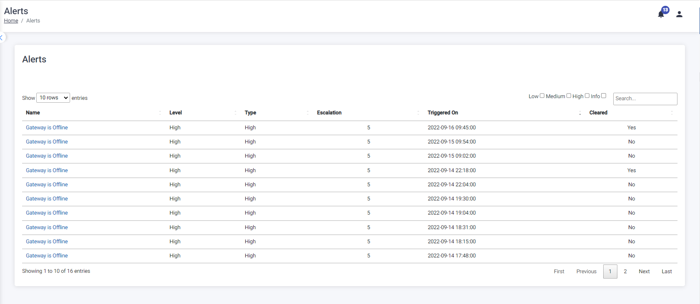

The Alerts tab displays all the alerts that have been triggered by the system for rules broken.

### View Alerts

The alerts can be viewed according to severity by selecting the checkbox on the right-hand side of the screen as indicated below:

To view the alert details, click on the Alert Name.

To return to the Alerts Management page click on the { width="60" } button.

### Manage Alerts

To clear or acknowledge an Alert, click on the check box on the left of the screen and the { width="60" } button will become visible, click on the { width="60" } button and the following message will be displayed:

A note can be added, once the note is added click on the { width="60" } button , if the user does not want to add a note click on the { width="40" } button.

Click on the Ok button to return to the Alert Info screen.

The note can be viewed on the view incident screen.

To return to the Alerts page, click on the { width="60" } button
