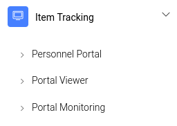
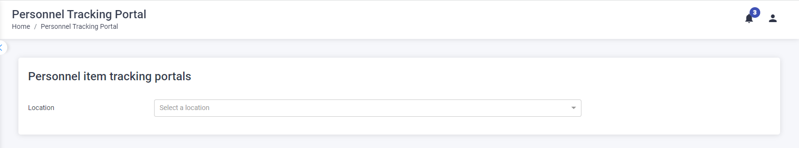
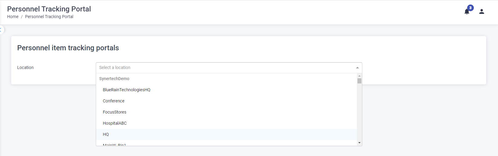
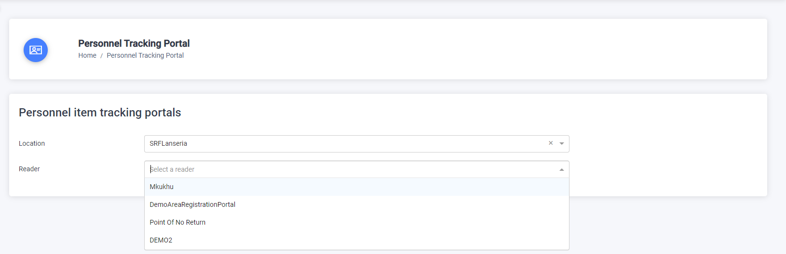
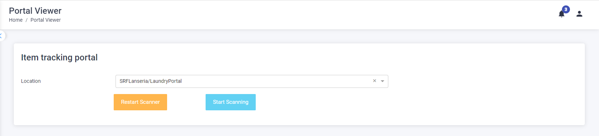
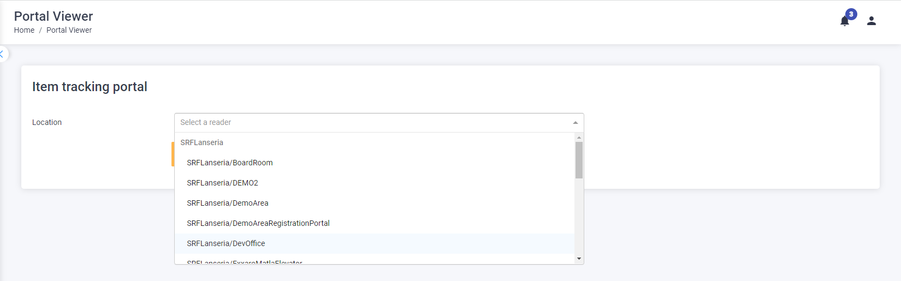
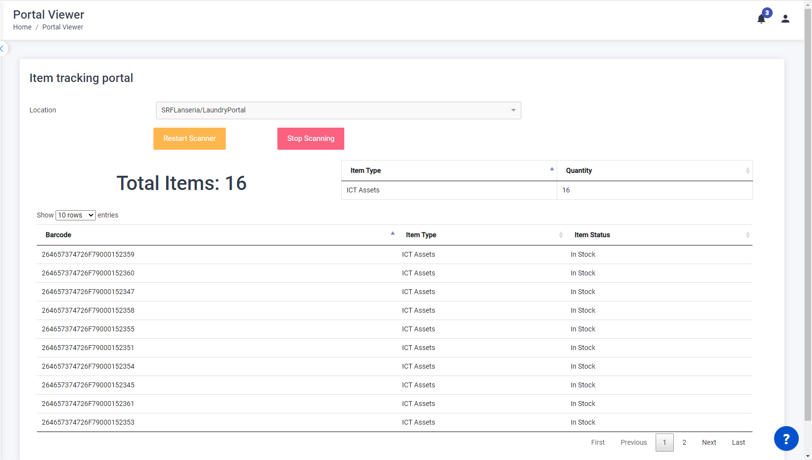
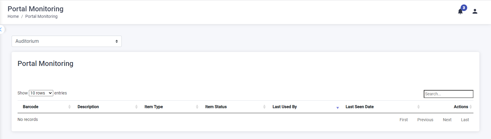
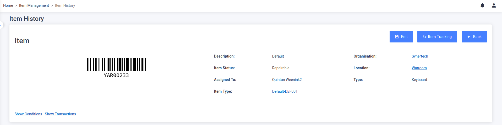

The Item Tracking portal tab allows the user to view specific items associated with staff like laptops, etc when passing through a RFID monitored portal/area.

## Personnel Portal

A user can track the items issued or linked to a user through a RFID portal.

From the Item Tracking menu select the Personnel Portal, the following screen will be displayed:

Select the location from the dropdown menu

Next select the Reader/Portal from the dropdown menu.

A “Waiting for Tags” message will be displayed.

When the reader reads the RFID tags present, both the user tag and the item tag, the tagged item details are displayed in green if the item is registered to the particular user, if the user tag is not present or the item is not registered/issued to the user then the tagged item details are displayed in red.

## Portal Viewer

The Portal Viewer allows a user to control a RFID portal by turning it on or off and view the items passing through a specific RFID portal in real time.

From the Item Tracking menu select the Portal Viewer, the following screen will be displayed:

Select the portal from the dropdown menu

Click on the  button to start the RFID reader

The RFID portal reads the tagged items and displays the information on the screen. The information displayed is:

- Total number of items read
- Number of items per item type
- Detailed list of all items

To stop the portal scanning, select the  button.

To reset the portal, select the  button.

## Portal Monitoring

The Portal Monitoring allows an user to view all RFID tags read at a selected location/reader.

From the Item Tracking menu select the Portal Viewer, the following screen will be displayed:

Select a location from the dropdown menu

All RFID tagged items read at the location/reader are displayed.

To view the details of the item, select the item barcode, the item details and history are displayed.

